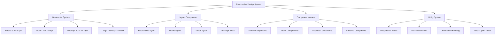
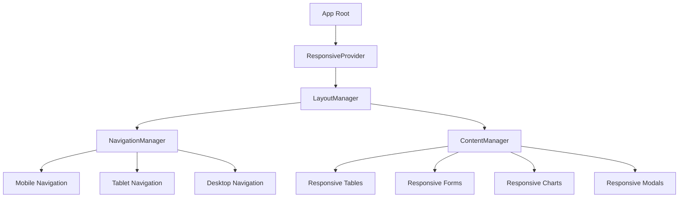

# Design Document

## Overview

This design document outlines the comprehensive responsive design system for the PetroManager petroleum distribution SaaS platform. Based on analysis of the current codebase, the design addresses critical gaps in dashboard components, navigation systems, data tables, and form components that currently lack proper responsive implementation.

The current application has foundational responsive components and mobile detection capabilities, but requires systematic enhancement to achieve consistent responsiveness across all features. This design establishes a cohesive responsive architecture that scales from mobile phones (320px) to large desktop displays (2560px+).

## Current State Analysis

### ✅ **Existing Responsive Infrastructure:**
- Basic mobile detection hooks (`useMobile`, `useIsMobile`)
- Mobile-optimized table components with card views
- Some chart components with `ResponsiveContainer`
- Settings preview components for theme testing
- Basic mobile layout wrapper

### ❌ **Critical Responsive Gaps:**

#### **Dashboard Components:**
- `TenantOptimizedDashboard`: Fixed grid layout `grid-cols-1 md:grid-cols-2 lg:grid-cols-3`
- `ModernDashboardOverview`: Complex grid layouts that don't stack properly on mobile
- Dashboard cards don't adapt properly to mobile screens
- Tank level displays need mobile optimization

#### **Navigation System:**
- `DashboardLayout`: No mobile navigation implementation
- Sidebar doesn't collapse on mobile
- No bottom navigation for mobile users
- Header doesn't adapt to mobile screens

#### **Data Tables:**
- `UsersTable`: Uses standard table layout without mobile card view
- Complex filtering UI that doesn't work on mobile
- No responsive column hiding/showing
- Action buttons too small for touch

#### **Forms and Modals:**
- `AccessibleModal`: Fixed size classes that don't adapt to mobile
- No full-screen mobile behavior
- Dialog positioning doesn't work on small screens

#### **Charts and Data Visualization:**
- Fixed height containers: `h-[300px] sm:h-[350px] lg:h-[400px]`
- Chart legends don't adapt to mobile
- Tooltips not optimized for touch

## Architecture

### Responsive Design System Architecture



### Component Hierarchy



## Components and Interfaces

### 1. Responsive Breakpoint System

#### Breakpoint Configuration
```typescript
interface BreakpointConfig {
  name: string;
  minWidth: number;
  maxWidth: number;
  containerWidth: number;
  columns: number;
  gutter: number;
  typography: TypographyScale;
  spacing: SpacingScale;
}

const BREAKPOINTS: Record<string, BreakpointConfig> = {
  mobile: {
    name: 'mobile',
    minWidth: 320,
    maxWidth: 767,
    containerWidth: 100,
    columns: 4,
    gutter: 16,
    typography: {
      base: '14px',
      scale: 1.125,
      lineHeight: 1.5
    },
    spacing: {
      xs: 4,
      sm: 8,
      md: 16,
      lg: 24,
      xl: 32
    }
  },
  tablet: {
    name: 'tablet',
    minWidth: 768,
    maxWidth: 1023,
    containerWidth: 90,
    columns: 8,
    gutter: 24,
    typography: {
      base: '16px',
      scale: 1.2,
      lineHeight: 1.6
    },
    spacing: {
      xs: 8,
      sm: 16,
      md: 24,
      lg: 32,
      xl: 48
    }
  },
  desktop: {
    name: 'desktop',
    minWidth: 1024,
    maxWidth: 1439,
    containerWidth: 1200,
    columns: 12,
    gutter: 32,
    typography: {
      base: '16px',
      scale: 1.25,
      lineHeight: 1.6
    },
    spacing: {
      xs: 8,
      sm: 16,
      md: 32,
      lg: 48,
      xl: 64
    }
  },
  largeDesktop: {
    name: 'largeDesktop',
    minWidth: 1440,
    maxWidth: Infinity,
    containerWidth: 1400,
    columns: 16,
    gutter: 40,
    typography: {
      base: '18px',
      scale: 1.3,
      lineHeight: 1.7
    },
    spacing: {
      xs: 12,
      sm: 24,
      md: 40,
      lg: 64,
      xl: 80
    }
  }
};
```

### 2. Responsive Layout Components

#### Enhanced DashboardLayout Component
```typescript
interface ResponsiveDashboardLayoutProps {
  children: React.ReactNode;
  tenant: string;
  className?: string;
}

const ResponsiveDashboardLayout: React.FC<ResponsiveDashboardLayoutProps> = ({
  children,
  tenant,
  className
}) => {
  const { isMobile, isTablet, isDesktop } = useResponsive();
  
  if (isMobile) {
    return (
      <MobileDashboardLayout tenant={tenant} className={className}>
        {children}
      </MobileDashboardLayout>
    );
  }
  
  if (isTablet) {
    return (
      <TabletDashboardLayout tenant={tenant} className={className}>
        {children}
      </TabletDashboardLayout>
    );
  }
  
  return (
    <DesktopDashboardLayout tenant={tenant} className={className}>
      {children}
    </DesktopDashboardLayout>
  );
};
```

#### Enhanced TenantOptimizedDashboard Component
```typescript
interface ResponsiveTenantOptimizedDashboardProps {
  tenant: string;
  className?: string;
}

const ResponsiveTenantOptimizedDashboard: React.FC<ResponsiveTenantOptimizedDashboardProps> = ({
  tenant,
  className
}) => {
  const { isMobile, isTablet } = useResponsive();
  
  // Mobile: Single column stack
  const mobileGridClass = "grid grid-cols-1 gap-4";
  
  // Tablet: Two column layout
  const tabletGridClass = "grid grid-cols-1 md:grid-cols-2 gap-6";
  
  // Desktop: Three column layout
  const desktopGridClass = "grid grid-cols-1 md:grid-cols-2 lg:grid-cols-3 gap-6";
  
  const gridClass = isMobile ? mobileGridClass : isTablet ? tabletGridClass : desktopGridClass;
  
  return (
    <div className={cn("space-y-6", className)}>
      {/* Responsive Header */}
      <div className={cn(
        "flex items-center justify-between",
        isMobile && "flex-col space-y-4",
        isTablet && "flex-col space-y-4 md:flex-row md:space-y-0"
      )}>
        <div className={cn(
          "text-center",
          !isMobile && "text-left"
        )}>
          <h1 className={cn(
            "font-bold text-gray-900",
            isMobile ? "text-2xl" : isTablet ? "text-3xl" : "text-3xl"
          )}>
            {tenant} Dashboard
          </h1>
          <p className={cn(
            "text-gray-600",
            isMobile ? "text-sm" : "text-base"
          )}>
            Welcome back! Here's what's happening with your operations.
          </p>
        </div>
        {!isMobile && (
          <div className="text-sm text-gray-500">
            Last updated: {new Date().toLocaleTimeString()}
          </div>
        )}
      </div>

      {/* Responsive Dashboard Grid */}
      <div className={gridClass}>
        {/* Dashboard cards with responsive sizing */}
        <DashboardCard 
          title="Tank Overview" 
          className={cn(
            isMobile ? "col-span-1" : isTablet ? "col-span-2" : "lg:col-span-2"
          )}
        >
          <ModernTankOverview tenant={tenant} searchTerm="" />
        </DashboardCard>
        
        {/* Additional responsive cards... */}
      </div>
    </div>
  );
};
```

### 3. Responsive Data Display Components

#### Enhanced UsersTable Component
```typescript
interface ResponsiveUsersTableProps {
  data: User[];
  onEdit: (user: User) => void;
  onDelete: (user: User) => void;
  onView: (user: User) => void;
  onCreate: () => void;
}

const ResponsiveUsersTable: React.FC<ResponsiveUsersTableProps> = ({
  data,
  onEdit,
  onDelete,
  onView,
  onCreate
}) => {
  const { isMobile, isTablet } = useResponsive();
  
  if (isMobile) {
    return (
      <MobileUsersTable
        data={data}
        onEdit={onEdit}
        onDelete={onDelete}
        onView={onView}
        onCreate={onCreate}
      />
    );
  }
  
  if (isTablet) {
    return (
      <TabletUsersTable
        data={data}
        onEdit={onEdit}
        onDelete={onDelete}
        onView={onView}
        onCreate={onCreate}
      />
    );
  }
  
  return (
    <DesktopUsersTable
      data={data}
      onEdit={onEdit}
      onDelete={onDelete}
      onView={onView}
      onCreate={onCreate}
    />
  );
};
```

#### Mobile Users Table (Card View)
```typescript
const MobileUsersTable: React.FC<ResponsiveUsersTableProps> = ({
  data,
  onEdit,
  onDelete,
  onView,
  onCreate
}) => {
  return (
    <div className="space-y-4">
      {/* Mobile Header */}
      <div className="flex items-center justify-between">
        <h2 className="text-lg font-semibold">Users</h2>
        <Button onClick={onCreate} size="sm">
          Add User
        </Button>
      </div>
      
      {/* Mobile Card List */}
      <div className="space-y-3">
        {data.map((user) => (
          <Card key={user.id} className="p-4">
            <div className="space-y-3">
              <div className="flex items-center justify-between">
                <div>
                  <h3 className="font-medium">{user.firstName} {user.lastName}</h3>
                  <p className="text-sm text-gray-600">{user.email}</p>
                </div>
                <Badge variant={user.status === 'ACTIVE' ? 'default' : 'secondary'}>
                  {user.status}
                </Badge>
              </div>
              
              <div className="flex items-center justify-between text-sm text-gray-500">
                <span>{user.role}</span>
                <span>{user.companyName}</span>
              </div>
              
              {/* Mobile Action Buttons */}
              <div className="flex space-x-2 pt-2">
                <Button 
                  variant="outline" 
                  size="sm" 
                  onClick={() => onView(user)}
                  className="flex-1"
                >
                  View
                </Button>
                <Button 
                  variant="outline" 
                  size="sm" 
                  onClick={() => onEdit(user)}
                  className="flex-1"
                >
                  Edit
                </Button>
                <Button 
                  variant="outline" 
                  size="sm" 
                  onClick={() => onDelete(user)}
                  className="flex-1"
                >
                  Delete
                </Button>
              </div>
            </div>
          </Card>
        ))}
      </div>
    </div>
  );
};
```

### 4. Responsive Chart Components

#### Enhanced ModernInventoryChart Component
```typescript
interface ResponsiveModernInventoryChartProps {
  className?: string;
}

const ResponsiveModernInventoryChart: React.FC<ResponsiveModernInventoryChartProps> = ({
  className
}) => {
  const { isMobile, isTablet } = useResponsive();
  
  // Responsive chart height
  const getChartHeight = () => {
    if (isMobile) return 250;
    if (isTablet) return 300;
    return 400;
  };
  
  // Responsive chart configuration
  const chartConfig = {
    mobile: {
      margin: { top: 10, right: 10, left: 0, bottom: 0 },
      legendPosition: 'bottom' as const,
      fontSize: 12
    },
    tablet: {
      margin: { top: 10, right: 20, left: 0, bottom: 0 },
      legendPosition: 'bottom' as const,
      fontSize: 14
    },
    desktop: {
      margin: { top: 10, right: 30, left: 0, bottom: 0 },
      legendPosition: 'top' as const,
      fontSize: 14
    }
  };
  
  const config = isMobile ? chartConfig.mobile : 
                isTablet ? chartConfig.tablet : 
                chartConfig.desktop;
  
  return (
    <Card className={className}>
      <CardHeader>
        <CardTitle className={cn(
          "flex items-center space-x-2",
          isMobile && "text-lg",
          isTablet && "text-xl",
          "text-2xl"
        )}>
          <TrendingUp className="h-5 w-5 text-blue-600" />
          <span>Inventory Trends</span>
        </CardTitle>
        <CardDescription className={cn(
          isMobile && "text-sm",
          "text-base"
        )}>
          Real-time inventory levels and consumption patterns
        </CardDescription>
      </CardHeader>

      <CardContent>
        <ChartContainer
          config={chartConfig}
          className={cn(
            "w-full",
            `h-[${getChartHeight()}px]`
          )}
        >
          <ResponsiveContainer width="100%" height="100%">
            <AreaChart
              data={data}
              margin={config.margin}
            >
              {/* Chart configuration based on device */}
              <CartesianGrid
                strokeDasharray="3 3"
                stroke="#E5E7EB"
                strokeOpacity={0.5}
              />
              <XAxis
                dataKey="date"
                tickLine={false}
                axisLine={false}
                tickMargin={8}
                tick={{ fontSize: config.fontSize }}
              />
              <YAxis
                tickLine={false}
                axisLine={false}
                tickMargin={8}
                tick={{ fontSize: config.fontSize }}
              />
              <Tooltip
                content={<ChartTooltipContent />}
                wrapperStyle={{ fontSize: config.fontSize }}
              />
              <Legend 
                verticalAlign={config.legendPosition}
                height={36}
                wrapperStyle={{ fontSize: config.fontSize }}
              />
              {/* Chart areas... */}
            </AreaChart>
          </ResponsiveContainer>
        </ChartContainer>
      </CardContent>
    </Card>
  );
};
```

### 4. Responsive Data Display Components

#### ResponsiveTable Component
```typescript
interface ResponsiveTableProps<T> {
  data: T[];
  columns: TableColumn<T>[];
  mobileColumns?: TableColumn<T>[];
  tabletColumns?: TableColumn<T>[];
  onRowClick?: (row: T) => void;
  className?: string;
}

const ResponsiveTable = <T,>({
  data,
  columns,
  mobileColumns,
  tabletColumns,
  onRowClick,
  className
}: ResponsiveTableProps<T>) => {
  const { isMobile, isTablet } = useResponsive();
  
  const getColumns = () => {
    if (isMobile && mobileColumns) return mobileColumns;
    if (isTablet && tabletColumns) return tabletColumns;
    return columns;
  };
  
  if (isMobile) {
    return (
      <MobileTable
        data={data}
        columns={getColumns()}
        onRowClick={onRowClick}
        className={className}
      />
    );
  }
  
  return (
    <DesktopTable
      data={data}
      columns={getColumns()}
      onRowClick={onRowClick}
      className={className}
    />
  );
};
```

#### Mobile Card Table
```typescript
interface MobileTableProps<T> {
  data: T[];
  columns: TableColumn<T>[];
  onRowClick?: (row: T) => void;
  className?: string;
}

const MobileTable = <T,>({
  data,
  columns,
  onRowClick,
  className
}: MobileTableProps<T>) => {
  return (
    <div className={cn('space-y-3', className)}>
      {data.map((row, index) => (
        <Card
          key={index}
          className="p-4 cursor-pointer hover:shadow-md transition-shadow"
          onClick={() => onRowClick?.(row)}
        >
          <div className="space-y-2">
            {columns.map((column) => (
              <div key={column.key} className="flex justify-between">
                <span className="text-sm font-medium text-muted-foreground">
                  {column.header}
                </span>
                <span className="text-sm">
                  {column.render ? column.render(row) : row[column.key]}
                </span>
              </div>
            ))}
          </div>
        </Card>
      ))}
    </div>
  );
};
```

### 5. Responsive Form Components

#### ResponsiveForm Component
```typescript
interface ResponsiveFormProps {
  children: React.ReactNode;
  onSubmit: (data: any) => void;
  className?: string;
}

const ResponsiveForm: React.FC<ResponsiveFormProps> = ({
  children,
  onSubmit,
  className
}) => {
  const { isMobile } = useResponsive();
  
  return (
    <form
      onSubmit={onSubmit}
      className={cn(
        'space-y-6',
        isMobile && 'px-4',
        className
      )}
    >
      {children}
    </form>
  );
};
```

#### Responsive Form Field
```typescript
interface ResponsiveFormFieldProps {
  label: string;
  children: React.ReactNode;
  error?: string;
  required?: boolean;
  className?: string;
}

const ResponsiveFormField: React.FC<ResponsiveFormFieldProps> = ({
  label,
  children,
  error,
  required,
  className
}) => {
  const { isMobile } = useResponsive();
  
  return (
    <div className={cn('space-y-2', className)}>
      <label className={cn(
        'text-sm font-medium',
        isMobile ? 'block' : 'inline-block'
      )}>
        {label}
        {required && <span className="text-red-500 ml-1">*</span>}
      </label>
      <div className={isMobile ? 'w-full' : ''}>
        {children}
      </div>
      {error && (
        <p className="text-sm text-red-600">{error}</p>
      )}
    </div>
  );
};
```

### 6. Responsive Chart Components

#### ResponsiveChart Component
```typescript
interface ResponsiveChartProps {
  data: any[];
  type: 'line' | 'bar' | 'pie' | 'area';
  height?: number;
  className?: string;
}

const ResponsiveChart: React.FC<ResponsiveChartProps> = ({
  data,
  type,
  height,
  className
}) => {
  const { isMobile, isTablet } = useResponsive();
  
  const getHeight = () => {
    if (height) return height;
    if (isMobile) return 250;
    if (isTablet) return 300;
    return 400;
  };
  
  const getConfig = () => ({
    responsive: true,
    maintainAspectRatio: false,
    plugins: {
      legend: {
        position: isMobile ? 'bottom' : 'top',
        labels: {
          font: {
            size: isMobile ? 12 : 14
          }
        }
      }
    }
  });
  
  return (
    <div className={cn('w-full', className)} style={{ height: getHeight() }}>
      <ResponsiveContainer width="100%" height="100%">
        {type === 'line' && <LineChart data={data} />}
        {type === 'bar' && <BarChart data={data} />}
        {type === 'pie' && <PieChart data={data} />}
        {type === 'area' && <AreaChart data={data} />}
      </ResponsiveContainer>
    </div>
  );
};
```

## Data Models

### Responsive State Management
```typescript
interface ResponsiveState {
  breakpoint: string;
  isMobile: boolean;
  isTablet: boolean;
  isDesktop: boolean;
  isLargeDesktop: boolean;
  orientation: 'portrait' | 'landscape';
  viewportWidth: number;
  viewportHeight: number;
  safeAreaInsets: {
    top: number;
    bottom: number;
    left: number;
    right: number;
  };
}

interface ResponsiveContextType {
  state: ResponsiveState;
  updateState: (newState: Partial<ResponsiveState>) => void;
  getBreakpoint: () => BreakpointConfig;
  isBreakpoint: (breakpoint: string) => boolean;
}
```

### Component Variant System
```typescript
interface ComponentVariants {
  size: 'sm' | 'md' | 'lg' | 'xl';
  variant: 'default' | 'primary' | 'secondary' | 'outline' | 'ghost';
  responsive: {
    mobile: Partial<ComponentVariants>;
    tablet: Partial<ComponentVariants>;
    desktop: Partial<ComponentVariants>;
  };
}

interface ResponsiveComponentProps {
  variants?: ComponentVariants;
  className?: string;
  children: React.ReactNode;
}
```

## Error Handling

### Responsive Error Boundaries
```typescript
interface ResponsiveErrorBoundaryProps {
  children: React.ReactNode;
  fallback?: React.ComponentType<{ error: Error; resetError: () => void }>;
}

const ResponsiveErrorBoundary: React.FC<ResponsiveErrorBoundaryProps> = ({
  children,
  fallback: Fallback
}) => {
  const { isMobile } = useResponsive();
  
  return (
    <ErrorBoundary
      fallback={({ error, resetError }) => (
        <div className={cn(
          'p-4 text-center',
          isMobile ? 'px-6' : 'px-8'
        )}>
          <h2 className="text-lg font-semibold mb-2">Something went wrong</h2>
          <p className="text-muted-foreground mb-4">
            {isMobile ? 'Please try again.' : error.message}
          </p>
          <Button onClick={resetError} variant="outline">
            Try Again
          </Button>
        </div>
      )}
    >
      {children}
    </ErrorBoundary>
  );
};
```

### Responsive Loading States
```typescript
interface ResponsiveLoadingProps {
  type: 'skeleton' | 'spinner' | 'pulse';
  className?: string;
}

const ResponsiveLoading: React.FC<ResponsiveLoadingProps> = ({
  type,
  className
}) => {
  const { isMobile } = useResponsive();
  
  if (type === 'skeleton') {
    return (
      <div className={cn('space-y-3', className)}>
        {Array.from({ length: isMobile ? 3 : 5 }).map((_, i) => (
          <div key={i} className="animate-pulse">
            <div className="h-4 bg-gray-200 rounded w-3/4 mb-2" />
            <div className="h-3 bg-gray-200 rounded w-1/2" />
          </div>
        ))}
      </div>
    );
  }
  
  return (
    <div className={cn('flex justify-center items-center', className)}>
      <div className="animate-spin rounded-full h-8 w-8 border-b-2 border-primary" />
    </div>
  );
};
```

## Testing Strategy

### Responsive Testing Framework
```typescript
interface ResponsiveTestConfig {
  breakpoints: string[];
  orientations: ('portrait' | 'landscape')[];
  devices: {
    name: string;
    width: number;
    height: number;
    userAgent: string;
  }[];
}

const RESPONSIVE_TEST_CONFIG: ResponsiveTestConfig = {
  breakpoints: ['mobile', 'tablet', 'desktop', 'largeDesktop'],
  orientations: ['portrait', 'landscape'],
  devices: [
    { name: 'iPhone SE', width: 375, height: 667, userAgent: 'Mobile' },
    { name: 'iPad', width: 768, height: 1024, userAgent: 'Tablet' },
    { name: 'Desktop', width: 1200, height: 800, userAgent: 'Desktop' }
  ]
};
```

### Component Testing Utilities
```typescript
const renderWithResponsive = (
  component: React.ReactElement,
  breakpoint: string = 'desktop'
) => {
  const mockResponsiveState = {
    breakpoint,
    isMobile: breakpoint === 'mobile',
    isTablet: breakpoint === 'tablet',
    isDesktop: breakpoint === 'desktop',
    isLargeDesktop: breakpoint === 'largeDesktop',
    orientation: 'portrait' as const,
    viewportWidth: 1200,
    viewportHeight: 800,
    safeAreaInsets: { top: 0, bottom: 0, left: 0, right: 0 }
  };
  
  return render(
    <ResponsiveProvider initialState={mockResponsiveState}>
      {component}
    </ResponsiveProvider>
  );
};
```

### Visual Regression Testing
```typescript
const responsiveVisualTests = [
  {
    name: 'Mobile Layout',
    breakpoint: 'mobile',
    viewport: { width: 375, height: 667 }
  },
  {
    name: 'Tablet Layout',
    breakpoint: 'tablet',
    viewport: { width: 768, height: 1024 }
  },
  {
    name: 'Desktop Layout',
    breakpoint: 'desktop',
    viewport: { width: 1200, height: 800 }
  }
];
```

This design establishes a comprehensive responsive system that ensures the PetroManager application provides optimal user experience across all device types while maintaining performance, accessibility, and functionality standards.
