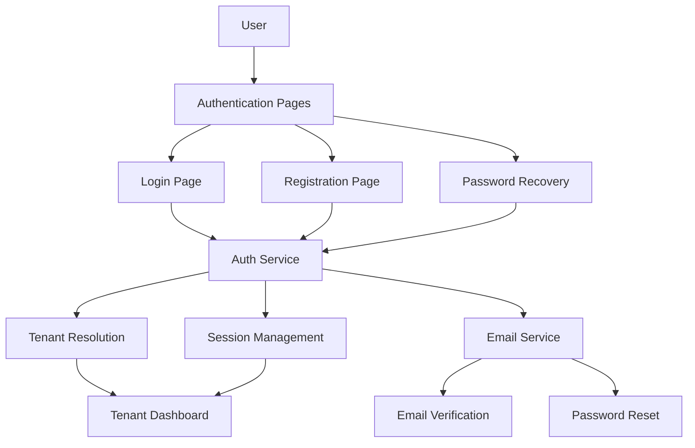
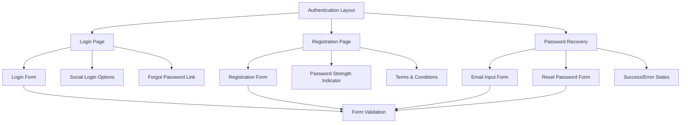

# Authentication Pages Design Document

## Overview

This document outlines the comprehensive design for sleek, visually appealing authentication pages for the petroleum SaaS platform. The design is inspired by the WellFound login page layout, featuring a split-screen approach with a clean functional form on the left and engaging visual marketing content on the right. The design focuses on creating a modern, professional user experience that aligns with the petroleum industry's requirements while maintaining excellent usability and accessibility.

## Architecture

### High-Level Architecture



### Component Structure



## Components and Interfaces

### 1. Authentication Layout Component

**Purpose**: Provides consistent layout and branding across all authentication pages

**Props Interface**:

```typescript
interface AuthLayoutProps {
  children: React.ReactNode;
  title: string;
  subtitle?: string;
  showBackButton?: boolean;
  onBackClick?: () => void;
}
```

**Design Specifications**:

- Split-screen layout: 40% functional form, 60% visual marketing section
- Left panel: Clean white background with form elements
- Right panel: Vibrant, engaging visuals with petroleum industry themes
- Responsive design that stacks vertically on mobile
- Consistent branding with logo and navigation
- Modern, professional aesthetic with playful visual elements

### 2. Login Page Component

**Purpose**: Secure user authentication with modern UX

**Props Interface**:

```typescript
interface LoginPageProps {
  onLogin: (credentials: LoginCredentials) => Promise<void>;
  onForgotPassword: () => void;
  onRegister: () => void;
  isLoading?: boolean;
  error?: string;
}

interface LoginCredentials {
  email: string;
  password: string;
  rememberMe?: boolean;
}
```

**Design Specifications**:

- Clean, minimal form design with standard labels
- Email and password fields with validation
- "Remember Me" checkbox with subtle styling
- Primary login button with loading state
- Secondary actions (Forgot Password, Sign Up) with clear hierarchy
- Error states with user-friendly messaging
- Success states with smooth transitions
- Social login option (Google) with prominent placement
- Horizontal separator with "or Login with Email" text

### 3. Registration Page Component

**Purpose**: User account creation with comprehensive validation

**Props Interface**:

```typescript
interface RegistrationPageProps {
  onRegister: (userData: RegistrationData) => Promise<void>;
  onLogin: () => void;
  isLoading?: boolean;
  error?: string;
}

interface RegistrationData {
  firstName: string;
  lastName: string;
  email: string;
  password: string;
  confirmPassword: string;
  companyName?: string;
  agreeToTerms: boolean;
}
```

**Design Specifications**:

- Single-step form with clear field layout
- Real-time password strength validation
- Company name field for B2B context
- Terms and conditions text with clickable links
- Email format validation with visual feedback
- Password confirmation with match validation
- Success state with email verification message
- Social signup option (Google) with prominent placement
- Horizontal separator with "or Sign up with Email" text

### 4. Password Recovery Component

**Purpose**: Secure password reset functionality

**Props Interface**:

```typescript
interface PasswordRecoveryProps {
  onSendResetEmail: (email: string) => Promise<void>;
  onResetPassword: (token: string, newPassword: string) => Promise<void>;
  onBackToLogin: () => void;
  isLoading?: boolean;
  error?: string;
  success?: string;
}
```

**Design Specifications**:

- Two-step process: email input → password reset
- Clear instructions and progress indicators
- Secure password reset form with strength validation
- Success states with confirmation messaging
- Error handling for expired/invalid tokens
- Resend email functionality

### 5. Form Validation Components

**Purpose**: Real-time form validation with user feedback

**Props Interface**:

```typescript
interface FormFieldProps {
  label: string;
  type: 'text' | 'email' | 'password';
  value: string;
  onChange: (value: string) => void;
  error?: string;
  required?: boolean;
  placeholder?: string;
  autoComplete?: string;
}

interface PasswordStrengthProps {
  password: string;
  minLength?: number;
  requireUppercase?: boolean;
  requireLowercase?: boolean;
  requireNumbers?: boolean;
  requireSpecialChars?: boolean;
}
```

**Design Specifications**:

- Floating labels with smooth animations
- Real-time validation with visual feedback
- Password strength indicator with color coding
- Error messages with specific guidance
- Success states with checkmark icons
- Accessibility features (ARIA labels, keyboard navigation)

## Data Models

### User Authentication Data

```typescript
interface User {
  id: string;
  email: string;
  firstName: string;
  lastName: string;
  companyName?: string;
  tenantId: string;
  role: 'admin' | 'manager' | 'operator' | 'driver';
  isEmailVerified: boolean;
  createdAt: Date;
  lastLoginAt?: Date;
}

interface AuthSession {
  userId: string;
  tenantId: string;
  token: string;
  expiresAt: Date;
  refreshToken: string;
  userAgent: string;
  ipAddress: string;
}

interface PasswordResetToken {
  userId: string;
  token: string;
  expiresAt: Date;
  used: boolean;
  createdAt: Date;
}
```

### Form State Management

```typescript
interface AuthFormState {
  isLoading: boolean;
  error: string | null;
  success: string | null;
  fieldErrors: Record<string, string>;
  touched: Record<string, boolean>;
}

interface LoginFormState extends AuthFormState {
  email: string;
  password: string;
  rememberMe: boolean;
}

interface RegistrationFormState extends AuthFormState {
  firstName: string;
  lastName: string;
  email: string;
  password: string;
  confirmPassword: string;
  companyName: string;
  agreeToTerms: boolean;
}
```

## Error Handling

### Error Types and Messages

```typescript
interface AuthError {
  type: 'validation' | 'authentication' | 'network' | 'server';
  code: string;
  message: string;
  field?: string;
  details?: Record<string, any>;
}

const ERROR_MESSAGES = {
  INVALID_CREDENTIALS: 'Invalid email or password. Please try again.',
  EMAIL_NOT_VERIFIED: 'Please verify your email address before logging in.',
  ACCOUNT_LOCKED: 'Account temporarily locked. Please try again later.',
  WEAK_PASSWORD:
    'Password must be at least 8 characters with uppercase, lowercase, number, and special character.',
  EMAIL_ALREADY_EXISTS: 'An account with this email already exists.',
  INVALID_EMAIL: 'Please enter a valid email address.',
  PASSWORDS_DONT_MATCH: 'Passwords do not match.',
  TERMS_NOT_ACCEPTED: 'Please accept the terms and conditions.',
  RESET_TOKEN_EXPIRED:
    'Password reset link has expired. Please request a new one.',
  NETWORK_ERROR: 'Network error. Please check your connection and try again.',
  SERVER_ERROR: 'Server error. Please try again later.',
};
```

### Error Display Strategy

- **Field-level errors**: Display inline with specific field
- **Form-level errors**: Display at top of form with clear messaging
- **Network errors**: Show retry option with user-friendly message
- **Validation errors**: Show real-time feedback as user types
- **Security errors**: Show generic message without revealing details

## Testing Strategy

### Unit Testing

- Form validation logic
- Password strength calculation
- Email format validation
- Error message generation
- State management functions

### Integration Testing

- Authentication flow end-to-end
- Form submission and API integration
- Error handling and recovery
- Session management
- Multi-tenant routing

### E2E Testing

- Complete user registration flow
- Login with various scenarios
- Password recovery process
- Error state handling
- Mobile responsiveness
- Accessibility compliance

### Performance Testing

- Form rendering performance
- Validation response times
- API call optimization
- Bundle size analysis
- Loading state transitions

## Visual Design Specifications

### Color Palette

```css
:root {
  /* Primary Colors - Inspired by WellFound */
  --primary-50: #eff6ff;
  --primary-100: #dbeafe;
  --primary-500: #3b82f6;
  --primary-600: #2563eb;
  --primary-700: #1d4ed8;

  /* Petroleum Industry Colors */
  --petroleum-50: #f0f9ff;
  --petroleum-100: #e0f2fe;
  --petroleum-500: #0ea5e9;
  --petroleum-600: #0284c7;
  --petroleum-700: #0369a1;

  /* WellFound-inspired Accent Colors */
  --accent-pink: #ff6b9d;
  --accent-orange: #ff8c42;
  --accent-yellow: #ffd93d;
  --accent-green: #6bcf7f;
  --accent-blue: #4dabf7;

  /* Neutral Colors */
  --gray-50: #f9fafb;
  --gray-100: #f3f4f6;
  --gray-200: #e5e7eb;
  --gray-300: #d1d5db;
  --gray-400: #9ca3af;
  --gray-500: #6b7280;
  --gray-600: #4b5563;
  --gray-700: #374151;
  --gray-800: #1f2937;
  --gray-900: #111827;

  /* Status Colors */
  --success-50: #f0fdf4;
  --success-500: #22c55e;
  --success-600: #16a34a;
  --error-50: #fef2f2;
  --error-500: #ef4444;
  --error-600: #dc2626;
  --warning-50: #fffbeb;
  --warning-500: #f59e0b;
  --warning-600: #d97706;
}
```

### Typography

```css
/* Font Families */
--font-primary:
  'Poppins', -apple-system, BlinkMacSystemFont, 'Segoe UI', sans-serif;
--font-mono: 'JetBrains Mono', 'Fira Code', monospace;

/* Font Sizes */
--text-xs: 0.75rem; /* 12px */
--text-sm: 0.875rem; /* 14px */
--text-base: 1rem; /* 16px */
--text-lg: 1.125rem; /* 18px */
--text-xl: 1.25rem; /* 20px */
--text-2xl: 1.5rem; /* 24px */
--text-3xl: 1.875rem; /* 30px */
--text-4xl: 2.25rem; /* 36px */

/* Font Weights */
--font-normal: 400;
--font-medium: 500;
--font-semibold: 600;
--font-bold: 700;
```

### Spacing and Layout

```css
/* Spacing Scale */
--space-1: 0.25rem; /* 4px */
--space-2: 0.5rem; /* 8px */
--space-3: 0.75rem; /* 12px */
--space-4: 1rem; /* 16px */
--space-5: 1.25rem; /* 20px */
--space-6: 1.5rem; /* 24px */
--space-8: 2rem; /* 32px */
--space-10: 2.5rem; /* 40px */
--space-12: 3rem; /* 48px */
--space-16: 4rem; /* 64px */
--space-20: 5rem; /* 80px */

/* Border Radius */
--radius-sm: 0.125rem; /* 2px */
--radius-md: 0.375rem; /* 6px */
--radius-lg: 0.5rem; /* 8px */
--radius-xl: 0.75rem; /* 12px */
--radius-2xl: 1rem; /* 16px */

/* Shadows */
--shadow-sm: 0 1px 2px 0 rgb(0 0 0 / 0.05);
--shadow-md: 0 4px 6px -1px rgb(0 0 0 / 0.1), 0 2px 4px -2px rgb(0 0 0 / 0.1);
--shadow-lg: 0 10px 15px -3px rgb(0 0 0 / 0.1), 0 4px 6px -4px rgb(0 0 0 / 0.1);
--shadow-xl:
  0 20px 25px -5px rgb(0 0 0 / 0.1), 0 8px 10px -6px rgb(0 0 0 / 0.1);
```

### Component Styling

#### Form Fields

- Standard labels above input fields
- Focus states with primary color border
- Error states with red border and message
- Success states with green checkmark
- Disabled states with reduced opacity
- Light gray borders with white backgrounds

#### Buttons

- Primary: Solid black background with white text
- Secondary: White background with light gray border
- Social: White background with gray border and logo
- Loading: Spinner animation with disabled state
- Hover: Subtle scale and shadow effects

#### Cards and Containers

- White background with subtle shadow
- Rounded corners for modern appearance
- Responsive padding and margins
- Smooth transitions for state changes

#### Visual Marketing Section

- Vibrant, engaging visuals with petroleum industry themes
- Abstract geometric shapes in bright colors (pink, orange, yellow, green, blue)
- 3D rendered objects and equipment
- Diverse human figures representing the industry
- Grid-like arrangement with playful, modern aesthetic
- Marketing text with clear hierarchy and messaging

### Responsive Design

#### Breakpoints

```css
--breakpoint-sm: 640px; /* Mobile */
--breakpoint-md: 768px; /* Tablet */
--breakpoint-lg: 1024px; /* Desktop */
--breakpoint-xl: 1280px; /* Large Desktop */
```

#### Mobile-First Approach

- Single column layout on mobile
- Stacked form elements
- Touch-friendly button sizes
- Optimized typography scaling
- Simplified navigation
- Visual marketing section stacks below form

#### Desktop Enhancements

- Split-screen layout: 40% form, 60% visual marketing
- Hover effects and animations
- Keyboard navigation support
- Enhanced visual hierarchy
- Sidebar navigation options
- Engaging visual content on the right panel

### Accessibility Features

#### Keyboard Navigation

- Tab order follows logical flow
- Enter key submits forms
- Escape key closes modals
- Arrow keys navigate options
- Focus indicators are clearly visible

#### Screen Reader Support

- Semantic HTML structure
- ARIA labels and descriptions
- Live regions for dynamic content
- Proper heading hierarchy
- Alt text for images

#### Visual Accessibility

- High contrast ratios (4.5:1 minimum)
- Color is not the only indicator
- Text scales with browser settings
- Focus indicators are prominent
- Error states are clearly marked

### Animation and Transitions

#### Micro-interactions

- Button hover effects (scale, shadow)
- Form field focus animations
- Loading spinner rotations
- Success checkmark animations
- Error shake animations

#### Page Transitions

- Smooth fade-in on page load
- Slide transitions between forms
- Loading state overlays
- Success message animations
- Error state transitions

#### Performance Considerations

- Use CSS transforms for animations
- Implement `will-change` for smooth performance
- Reduce motion for users who prefer it
- Optimize animation timing functions
- Use hardware acceleration where possible
