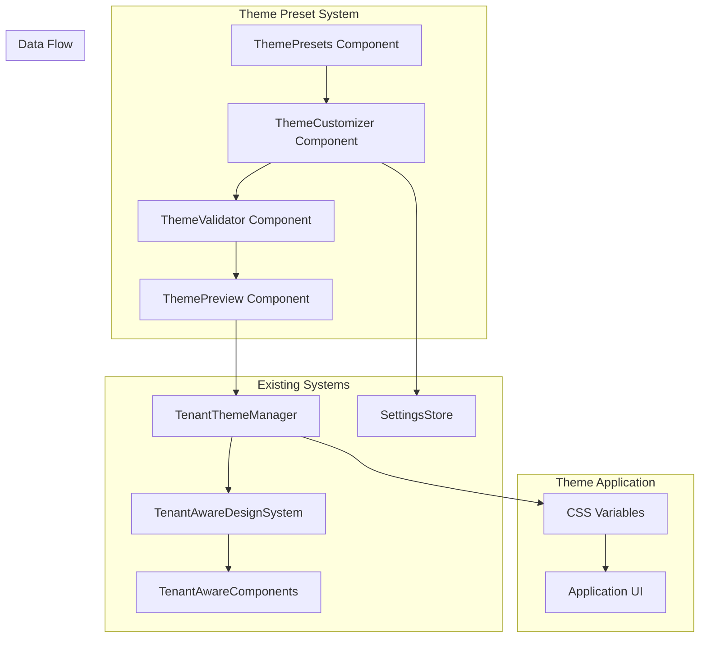

# Design Document

## Overview

The Branding Preset Themes feature extends the existing tenant-aware theming system to provide curated theme presets with real-time customization capabilities. The design builds upon the current `TenantThemeManager`, `BrandingSettingsData`, and tenant-aware components to deliver a seamless theme selection and customization experience.

The system will provide companies with pre-built theme templates that can be instantly applied and customized in real-time, ensuring consistent branding across the entire petroleum management application.

## Architecture

### System Components



### Theme Data Structure

```typescript
interface ThemePreset {
  id: string;
  name: string;
  description: string;
  category: 'corporate' | 'modern' | 'vibrant' | 'minimal' | 'dark';
  icon: React.ReactNode;
  colors: ColorScheme;
  typography: TypographyConfig;
  tags: string[];
  accessibility: {
    contrastRatio: number;
    wcagCompliant: boolean;
    recommendations: string[];
  };
}

interface ThemeCustomization {
  presetId: string;
  customizations: {
    colors: Partial<ColorScheme>;
    typography: Partial<TypographyConfig>;
    logo?: LogoConfig;
    favicon?: string;
  };
  appliedAt: Date;
  lastModified: Date;
}
```

## Components and Interfaces

### 1. Enhanced ThemePresets Component

**Location:** `components/settings/theme-presets.tsx`

**Enhancements:**
- Real-time theme application on selection
- Improved preset categorization and filtering
- Accessibility indicators for each preset
- Preview thumbnails with live color swatches

```typescript
interface EnhancedThemePresetsProps {
  onPresetSelect: (preset: ThemePreset) => void;
  currentTheme?: BrandingSettingsData;
  onPreviewMode?: (enabled: boolean) => void;
  showAccessibilityInfo?: boolean;
}

export function EnhancedThemePresets({
  onPresetSelect,
  currentTheme,
  onPreviewMode,
  showAccessibilityInfo = true
}: EnhancedThemePresetsProps) {
  // Enhanced implementation with real-time application
}
```

### 2. New ThemeCustomizer Component

**Location:** `components/settings/theme-customizer.tsx`

**Purpose:** Real-time theme customization with live preview

```typescript
interface ThemeCustomizerProps {
  baseTheme: ThemePreset;
  currentCustomizations: ThemeCustomization;
  onThemeChange: (customizations: ThemeCustomization) => void;
  onSave: () => void;
  onReset: () => void;
  onExport: () => void;
  onImport: (themeData: string) => void;
}

export function ThemeCustomizer({
  baseTheme,
  currentCustomizations,
  onThemeChange,
  onSave,
  onReset,
  onExport,
  onImport
}: ThemeCustomizerProps) {
  // Real-time customization interface
}
```

### 3. New ThemeValidator Component

**Location:** `components/settings/theme-validator.tsx`

**Purpose:** Accessibility validation and compliance checking

```typescript
interface ThemeValidatorProps {
  theme: BrandingSettingsData;
  onValidationComplete: (results: ValidationResults) => void;
  showWarnings?: boolean;
  enforceWCAG?: boolean;
}

interface ValidationResults {
  isCompliant: boolean;
  contrastRatios: Record<string, number>;
  warnings: ValidationWarning[];
  recommendations: string[];
  score: number; // 0-100 accessibility score
}

export function ThemeValidator({
  theme,
  onValidationComplete,
  showWarnings = true,
  enforceWCAG = true
}: ThemeValidatorProps) {
  // Accessibility validation logic
}
```

### 4. Enhanced ThemePreview Component

**Location:** `components/settings/theme-preview.tsx`

**Enhancements:**
- Comprehensive UI component previews
- Side-by-side comparison mode
- Responsive preview testing
- Export functionality

```typescript
interface EnhancedThemePreviewProps {
  brandingData: BrandingSettingsData;
  onThemeChange: (theme: BrandingSettingsData) => void;
  onExport: () => void;
  onImport: (themeData: string) => void;
  onReset: () => void;
  previewMode: 'components' | 'comparison' | 'responsive';
  showAccessibilityInfo?: boolean;
}

export function EnhancedThemePreview({
  brandingData,
  onThemeChange,
  onExport,
  onImport,
  onReset,
  previewMode = 'components',
  showAccessibilityInfo = true
}: EnhancedThemePreviewProps) {
  // Enhanced preview with multiple modes
}
```

## Data Models

### Theme Preset Data Structure

```typescript
// Enhanced preset structure with accessibility data
interface ThemePreset {
  id: string;
  name: string;
  description: string;
  category: 'corporate' | 'modern' | 'vibrant' | 'minimal' | 'dark';
  icon: React.ReactNode;
  colors: {
    primary: string;
    secondary: string;
    accent: string;
    background: string;
    surface: string;
    text: string;
    success: string;
    warning: string;
    error: string;
  };
  typography: {
    fontFamily: string;
    headingFont: string;
    fontSizes: {
      xs: string;
      sm: string;
      base: string;
      lg: string;
      xl: string;
      '2xl': string;
      '3xl': string;
      '4xl': string;
    };
  };
  tags: string[];
  accessibility: {
    contrastRatio: number;
    wcagCompliant: boolean;
    recommendations: string[];
    score: number;
  };
  metadata: {
    createdBy: string;
    version: string;
    lastUpdated: Date;
    industry: string[];
  };
}

// Customization tracking
interface ThemeCustomization {
  presetId: string;
  customizations: {
    colors: Partial<ColorScheme>;
    typography: Partial<TypographyConfig>;
    logo?: LogoConfig;
    favicon?: string;
  };
  appliedAt: Date;
  lastModified: Date;
  version: string;
}

// Validation results
interface ValidationResults {
  isCompliant: boolean;
  contrastRatios: Record<string, number>;
  warnings: ValidationWarning[];
  recommendations: string[];
  score: number;
  lastValidated: Date;
}

interface ValidationWarning {
  type: 'contrast' | 'readability' | 'accessibility';
  severity: 'low' | 'medium' | 'high';
  message: string;
  element: string;
  suggestion: string;
}
```

### Settings Store Integration

```typescript
// Enhanced settings store with theme management
interface EnhancedSettingsStore {
  // Existing properties...
  
  // New theme management properties
  currentThemePreset: ThemePreset | null;
  themeCustomizations: ThemeCustomization | null;
  themeHistory: ThemeCustomization[];
  validationResults: ValidationResults | null;
  
  // New theme management actions
  setThemePreset: (preset: ThemePreset) => void;
  applyThemeCustomization: (customization: ThemeCustomization) => void;
  saveThemeCustomization: () => void;
  resetThemeCustomization: () => void;
  exportTheme: () => string;
  importTheme: (themeData: string) => void;
  validateTheme: (theme: BrandingSettingsData) => ValidationResults;
  addToThemeHistory: (customization: ThemeCustomization) => void;
  undoThemeChange: () => void;
  redoThemeChange: () => void;
}
```

## Error Handling

### Theme Application Errors

```typescript
interface ThemeError {
  type: 'APPLICATION_ERROR' | 'VALIDATION_ERROR' | 'IMPORT_ERROR' | 'EXPORT_ERROR';
  code: string;
  message: string;
  details?: Record<string, any>;
  recoverable: boolean;
  suggestions: string[];
}

class ThemeErrorHandler {
  static handleApplicationError(error: Error): ThemeError {
    // Handle theme application failures
  }
  
  static handleValidationError(results: ValidationResults): ThemeError {
    // Handle accessibility validation failures
  }
  
  static handleImportError(error: Error, themeData: string): ThemeError {
    // Handle theme import failures
  }
  
  static handleExportError(error: Error): ThemeError {
    // Handle theme export failures
  }
}
```

### Error Recovery Strategies

1. **Theme Application Failure**
   - Fallback to previous theme
   - Show error notification with retry option
   - Log error for debugging

2. **Validation Failure**
   - Show warnings with suggestions
   - Prevent saving if critical issues
   - Provide accessibility improvement recommendations

3. **Import/Export Failure**
   - Validate data format before processing
   - Show specific error messages
   - Provide data format examples

## Testing Strategy

### Unit Tests

```typescript
// Theme preset selection tests
describe('ThemePresets Component', () => {
  it('should apply theme immediately on selection');
  it('should show accessibility indicators');
  it('should filter presets by category');
  it('should search presets by name and tags');
});

// Theme customization tests
describe('ThemeCustomizer Component', () => {
  it('should update theme in real-time');
  it('should validate color contrast ratios');
  it('should save customizations to store');
  it('should reset to preset theme');
});

// Theme validation tests
describe('ThemeValidator Component', () => {
  it('should validate WCAG compliance');
  it('should calculate contrast ratios');
  it('should provide accessibility recommendations');
  it('should prevent saving invalid themes');
});

// Theme preview tests
describe('ThemePreview Component', () => {
  it('should show comprehensive UI previews');
  it('should support side-by-side comparison');
  it('should test responsive behavior');
  it('should export theme configuration');
});
```

### Integration Tests

```typescript
// Theme system integration tests
describe('Theme System Integration', () => {
  it('should integrate with TenantThemeManager');
  it('should update CSS variables in real-time');
  it('should persist theme changes across sessions');
  it('should apply theme to all tenant-aware components');
});

// Settings store integration tests
describe('Settings Store Integration', () => {
  it('should save theme customizations');
  it('should maintain theme history');
  it('should support undo/redo functionality');
  it('should export/import theme configurations');
});
```

### End-to-End Tests

```typescript
// Complete theme workflow tests
describe('Theme Workflow E2E', () => {
  it('should complete theme selection and customization workflow');
  it('should apply theme across entire application');
  it('should maintain theme consistency across user sessions');
  it('should handle theme validation and accessibility compliance');
});
```

### Performance Tests

```typescript
// Theme application performance tests
describe('Theme Performance', () => {
  it('should apply theme changes within 100ms');
  it('should not cause layout shifts during theme changes');
  it('should handle large theme configurations efficiently');
  it('should optimize CSS variable updates');
});
```

## Implementation Plan

### Phase 1: Enhanced Theme Presets
- Enhance existing ThemePresets component
- Add real-time theme application
- Implement accessibility indicators
- Add preset categorization and filtering

### Phase 2: Theme Customization
- Create ThemeCustomizer component
- Implement real-time color and typography editing
- Add live preview functionality
- Integrate with existing settings store

### Phase 3: Theme Validation
- Create ThemeValidator component
- Implement WCAG compliance checking
- Add accessibility scoring system
- Provide improvement recommendations

### Phase 4: Enhanced Preview
- Enhance ThemePreview component
- Add comprehensive UI component previews
- Implement side-by-side comparison
- Add responsive testing capabilities

### Phase 5: Integration and Testing
- Integrate all components with existing systems
- Implement error handling and recovery
- Add comprehensive testing suite
- Performance optimization and monitoring

## Security Considerations

### Theme Data Validation
- Validate all imported theme configurations
- Sanitize color values and font names
- Prevent injection of malicious CSS
- Validate file uploads for theme imports

### Access Control
- Ensure only authorized users can modify themes
- Validate theme changes against user permissions
- Log all theme modifications for audit purposes
- Prevent unauthorized theme exports

### Data Protection
- Encrypt sensitive theme data in transit
- Validate theme data integrity
- Implement proper error handling to prevent data leaks
- Ensure theme changes don't expose sensitive information

## Performance Considerations

### Real-Time Updates
- Use CSS variables for efficient theme updates
- Implement debounced updates for rapid changes
- Optimize re-renders during theme customization
- Use React.memo for expensive components

### Memory Management
- Implement proper cleanup for theme listeners
- Optimize theme history storage
- Use lazy loading for theme previews
- Implement efficient theme caching

### Bundle Size
- Code split theme customization components
- Lazy load theme presets
- Optimize theme validation logic
- Minimize CSS bundle size impact

## Accessibility Considerations

### WCAG Compliance
- Ensure all theme presets meet WCAG AA standards
- Validate color contrast ratios automatically
- Provide accessibility recommendations
- Support high contrast mode

### User Experience
- Provide clear feedback for theme changes
- Support keyboard navigation
- Implement proper focus management
- Provide screen reader support

### Inclusive Design
- Support various visual impairments
- Provide alternative text for theme previews
- Ensure theme changes don't break accessibility features
- Support assistive technologies
