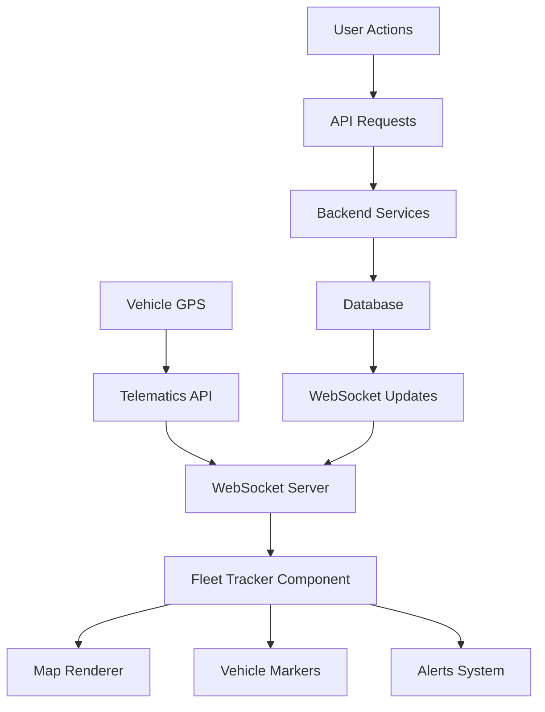

# Design Document

## Overview

The Fleet Tracker component is a modern, reusable React component that provides real-time vehicle tracking capabilities with beautiful, interactive maps. Built using industry-standard mapping libraries and following modern React patterns, it offers comprehensive fleet management features while maintaining excellent performance and user experience across all devices.

## Architecture

### Component Architecture

The Fleet Tracker follows a modular, layered architecture that separates concerns and enables easy testing and maintenance:

```
FleetTracker (Main Component)
├── MapContainer (Map Rendering Layer)
│   ├── MapRenderer (Core Map Implementation)
│   ├── VehicleMarkers (Vehicle Visualization)
│   └── GeofenceOverlay (Geofencing Visualization)
├── VehicleInfoPanel (Information Display)
│   ├── VehicleDetails (Individual Vehicle Info)
│   ├── VehicleList (Fleet Overview)
│   └── VehicleFilters (Filtering Controls)
├── ControlsPanel (Map Controls)
│   ├── MapControls (Zoom, Pan, etc.)
│   ├── LayerControls (Map Layer Toggle)
│   └── ViewControls (View Mode Selection)
├── AlertsPanel (Real-time Notifications)
│   ├── AlertList (Active Alerts)
│   ├── AlertSettings (Alert Configuration)
│   └── GeofenceManager (Geofence Creation)
└── DataLayer (Data Management)
    ├── WebSocketManager (Real-time Data)
    ├── DataCache (Local Data Storage)
    └── APIAdapter (External API Integration)
```

### Technology Stack

**Frontend Framework**: React 18+ with TypeScript
**Mapping Library**: Mapbox GL JS (primary) with Leaflet fallback
**State Management**: Zustand for global state, React Query for server state
**Styling**: Tailwind CSS with shadcn/ui components
**Real-time Communication**: WebSocket with Socket.io fallback
**Data Visualization**: Custom markers with Canvas API for performance
**Testing**: Jest + React Testing Library + Playwright

### Integration Points

- **API Integration**: RESTful APIs for vehicle data, geofencing, and historical routes
- **WebSocket Connection**: Real-time vehicle position updates
- **Authentication**: JWT-based authentication with role-based access
- **Theme System**: Integration with existing design system and theme provider
- **Responsive System**: Compatibility with existing responsive configuration

## Components and Interfaces

### Core Interfaces

```typescript
// Vehicle Data Model
interface Vehicle {
  id: string;
  name: string;
  licensePlate: string;
  driver: {
    id: string;
    name: string;
    phone?: string;
  };
  position: {
    lat: number;
    lng: number;
    accuracy: number;
    heading: number;
    speed: number;
    timestamp: Date;
  };
  status: 'active' | 'inactive' | 'maintenance' | 'offline';
  vehicleType: 'truck' | 'van' | 'car' | 'motorcycle';
  fuelLevel?: number;
  odometer?: number;
  lastUpdate: Date;
}

// Geofence Model
interface Geofence {
  id: string;
  name: string;
  type: 'inclusion' | 'exclusion';
  geometry: {
    type: 'Polygon' | 'Circle';
    coordinates: number[][];
    radius?: number; // for circles
  };
  rules: {
    enterAlert: boolean;
    exitAlert: boolean;
    speedLimit?: number;
  };
  color: string;
  isActive: boolean;
}

// Route Data Model
interface Route {
  id: string;
  vehicleId: string;
  startTime: Date;
  endTime?: Date;
  waypoints: {
    lat: number;
    lng: number;
    timestamp: Date;
    speed: number;
    heading: number;
  }[];
  distance: number;
  duration: number;
  status: 'planned' | 'active' | 'completed' | 'cancelled';
}

// Alert Model
interface Alert {
  id: string;
  type: 'geofence_enter' | 'geofence_exit' | 'speed_violation' | 'offline' | 'maintenance';
  vehicleId: string;
  geofenceId?: string;
  message: string;
  severity: 'low' | 'medium' | 'high' | 'critical';
  timestamp: Date;
  acknowledged: boolean;
  acknowledgedBy?: string;
}
```

### Component Props Interface

```typescript
interface FleetTrackerProps {
  // Core Configuration
  apiEndpoint: string;
  websocketUrl: string;
  mapboxAccessToken: string;
  
  // Display Options
  initialCenter?: { lat: number; lng: number };
  initialZoom?: number;
  mapStyle?: 'light' | 'dark' | 'satellite' | 'street';
  
  // Feature Toggles
  features?: {
    geofencing: boolean;
    routeHistory: boolean;
    realTimeUpdates: boolean;
    alerts: boolean;
    vehicleDetails: boolean;
  };
  
  // Styling
  className?: string;
  height?: string | number;
  theme?: 'light' | 'dark' | 'auto';
  
  // Event Handlers
  onVehicleSelect?: (vehicle: Vehicle) => void;
  onAlertTrigger?: (alert: Alert) => void;
  onGeofenceViolation?: (violation: GeofenceViolation) => void;
  
  // Data Sources
  vehicles?: Vehicle[];
  geofences?: Geofence[];
  routes?: Route[];
  
  // Performance Options
  updateInterval?: number; // milliseconds
  maxVehicles?: number;
  enableClustering?: boolean;
}
```

## Data Models

### Real-time Data Flow



### Data Caching Strategy

- **Vehicle Positions**: Cached for 5 minutes with LRU eviction
- **Route History**: Paginated with lazy loading
- **Geofences**: Cached until manually refreshed
- **Alerts**: Real-time with 24-hour retention

### State Management

```typescript
interface FleetTrackerState {
  // Map State
  map: MapboxMap | null;
  viewport: {
    center: [number, number];
    zoom: number;
    bearing: number;
    pitch: number;
  };
  
  // Vehicle State
  vehicles: Map<string, Vehicle>;
  selectedVehicle: string | null;
  vehicleFilters: {
    status: string[];
    type: string[];
    driver: string[];
  };
  
  // Geofence State
  geofences: Map<string, Geofence>;
  activeGeofences: Set<string>;
  
  // Alert State
  alerts: Alert[];
  unreadAlerts: number;
  
  // UI State
  isLoading: boolean;
  error: string | null;
  sidebarOpen: boolean;
  activePanel: 'vehicles' | 'alerts' | 'geofences' | 'routes';
}
```

## Error Handling

### Error Categories

1. **Network Errors**: Connection failures, timeout handling
2. **Data Errors**: Invalid vehicle data, malformed coordinates
3. **Map Errors**: Rendering failures, tile loading issues
4. **WebSocket Errors**: Connection drops, message parsing errors
5. **Permission Errors**: Location access, API authentication

### Error Recovery Strategies

- **Automatic Retry**: Exponential backoff for network requests
- **Fallback Modes**: Offline data display, cached positions
- **User Notifications**: Clear error messages with recovery actions
- **Graceful Degradation**: Reduced functionality when services unavailable

### Error Boundaries

```typescript
interface ErrorBoundaryState {
  hasError: boolean;
  error: Error | null;
  errorInfo: ErrorInfo | null;
}

class FleetTrackerErrorBoundary extends Component<
  PropsWithChildren<{}>,
  ErrorBoundaryState
> {
  // Error boundary implementation with recovery options
}
```

## Testing Strategy

### Unit Testing

- **Component Testing**: Individual component behavior and props
- **Hook Testing**: Custom hooks for data fetching and state management
- **Utility Testing**: Helper functions and data transformations
- **Mock Testing**: External API and WebSocket mocking

### Integration Testing

- **API Integration**: Real API calls with test data
- **WebSocket Testing**: Real-time data flow validation
- **Map Integration**: Map rendering and interaction testing
- **State Management**: Zustand store and React Query integration

### End-to-End Testing

- **User Workflows**: Complete fleet tracking scenarios
- **Cross-browser Testing**: Chrome, Firefox, Safari, Edge
- **Mobile Testing**: iOS Safari, Android Chrome
- **Performance Testing**: Large fleet handling, memory usage

### Test Coverage Goals

- **Unit Tests**: 90%+ coverage for utilities and components
- **Integration Tests**: 80%+ coverage for API interactions
- **E2E Tests**: Critical user paths and error scenarios

### Performance Testing

- **Load Testing**: 100+ vehicles with real-time updates
- **Memory Testing**: Long-running sessions, memory leaks
- **Rendering Performance**: 60fps map interactions
- **Network Testing**: Slow connections, offline scenarios

## Implementation Considerations

### Performance Optimizations

1. **Vehicle Clustering**: Group nearby vehicles to reduce marker count
2. **Canvas Rendering**: Use Canvas API for high-performance marker rendering
3. **Data Throttling**: Limit update frequency based on vehicle speed
4. **Lazy Loading**: Load route history and details on demand
5. **Memory Management**: Clean up unused data and event listeners

### Accessibility Features

1. **Keyboard Navigation**: Full keyboard support for map controls
2. **Screen Reader Support**: ARIA labels and descriptions
3. **High Contrast Mode**: Alternative color schemes
4. **Focus Management**: Clear focus indicators and logical tab order
5. **Alternative Text**: Descriptive text for map elements

### Security Considerations

1. **API Security**: JWT authentication, rate limiting
2. **Data Privacy**: Encrypted transmission, secure storage
3. **Input Validation**: Sanitize all user inputs
4. **CORS Configuration**: Proper cross-origin policies
5. **Content Security Policy**: Prevent XSS attacks

### Browser Compatibility

- **Modern Browsers**: Chrome 90+, Firefox 88+, Safari 14+, Edge 90+
- **Mobile Browsers**: iOS Safari 14+, Android Chrome 90+
- **Progressive Enhancement**: Core functionality without modern features
- **Polyfills**: WebSocket and Canvas support for older browsers

### Deployment Considerations

1. **CDN Integration**: Static assets served from CDN
2. **Environment Configuration**: Different API endpoints per environment
3. **Feature Flags**: Gradual rollout of new features
4. **Monitoring**: Error tracking and performance metrics
5. **Updates**: Hot reloading for development, versioned releases for production
