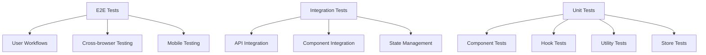
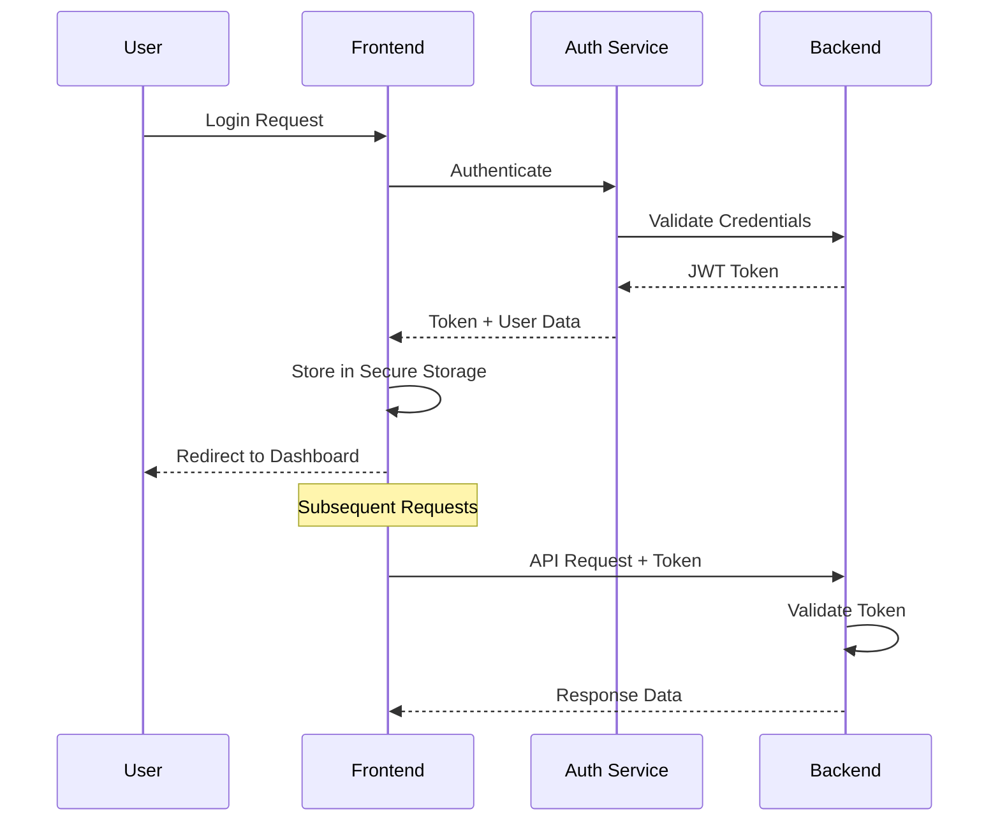

# Design Document

## Overview

This design document outlines the comprehensive frontend enhancement architecture for the PetroManager petroleum distribution SaaS platform. The design focuses on transforming the existing Next.js 15/React 19 application into an enterprise-grade, performant, and maintainable frontend system that follows modern best practices.

The enhancement strategy addresses performance optimization, state management, error handling, security, accessibility, and code quality while maintaining the existing multi-tenant architecture and component structure.

## Architecture

### High-Level Architecture

```mermaid
graph TB
    subgraph "Frontend Enhancement Architecture"
        A[Next.js 15 App Router] --> B[Performance Layer]
        A --> C[State Management Layer]
        A --> D[Error Handling Layer]
        A --> E[Security Layer]
        A --> F[Accessibility Layer]

        B --> B1[Code Splitting]
        B --> B2[Image Optimization]
        B --> B3[Bundle Optimization]
        B --> B4[Caching Strategy]

        C --> C1[Zustand Store]
        C --> C2[React Query]
        C --> C3[Form State]
        C --> C4[URL State]

        D --> D1[Error Boundaries]
        D --> D2[Toast System]
        D --> D3[Loading States]
        D --> D4[Recovery Mechanisms]

        E --> E1[Input Sanitization]
        E --> E2[CSP Headers]
        E --> E3[Authentication]
        E --> E4[Data Encryption]

        F --> F1[ARIA Labels]
        F --> F2[Keyboard Navigation]
        F --> F3[Screen Reader Support]
        F --> F4[Color Contrast]
    end

    subgraph "Backend Integration"
        G[API Gateway] --> H[Authentication Service]
        G --> I[Data Service]
        G --> J[Real-time Service]
    end

    A --> G
```



### Component Architecture Enhancement

```mermaid
graph TB
    subgraph "Enhanced Component Structure"
        A[App Root] --> B[Layout Components]
        A --> C[Page Components]
        A --> D[Feature Components]
        A --> E[UI Components]

        B --> B1[DashboardLayout]
        B --> B2[AuthLayout]
        B --> B3[ErrorLayout]

        C --> C1[Dashboard Page]
        C --> C2[Inventory Page]
        C --> C3[Distribution Page]

        D --> D1[Inventory Management]
        D --> D2[Fleet Tracking]
        D --> D3[Sales Analytics]

        E --> E1[shadcn/ui Base]
        E --> E2[Custom Components]
        E --> E3[Charts & Visualizations]
    end

    subgraph "State Management"
        F[Zustand Store] --> F1[Auth Store]
        F --> F2[UI Store]
        F --> F3[Tenant Store]

        G[React Query] --> G1[API Cache]
        G --> G2[Mutation Cache]
        G --> G3[Background Sync]
    end

    A --> F
    A --> G
```



## Components and Interfaces

### 1. Performance Optimization Components

#### Code Splitting Strategy

- **Route-based splitting**: Automatic code splitting for each page
- **Component-based splitting**: Lazy loading for heavy components
- **Library splitting**: Separate chunks for third-party libraries
- **Dynamic imports**: On-demand loading for non-critical features

#### Image Optimization

- **Next.js Image component**: Automatic optimization and lazy loading
- **WebP format**: Modern image formats with fallbacks
- **Responsive images**: Multiple sizes for different screen densities
- **Blur placeholders**: Smooth loading experience

#### Bundle Optimization

- **Tree shaking**: Remove unused code
- **Minification**: Compress JavaScript and CSS
- **Compression**: Gzip/Brotli compression
- **CDN integration**: Static asset delivery optimization

### 2. State Management Architecture

#### Zustand Store Structure

```typescript
interface AppState {
  // Authentication state
  auth: {
    user: User | null;
    token: string | null;
    isAuthenticated: boolean;
    permissions: string[];
  };

  // UI state
  ui: {
    theme: "light" | "dark";
    sidebarOpen: boolean;
    loading: boolean;
    notifications: Notification[];
  };

  // Tenant state
  tenant: {
    current: Tenant | null;
    settings: TenantSettings;
    branding: BrandingConfig;
  };
}
```

#### React Query Configuration

```typescript
const queryClient = new QueryClient({
  defaultOptions: {
    queries: {
      staleTime: 5 * 60 * 1000, // 5 minutes
      cacheTime: 10 * 60 * 1000, // 10 minutes
      retry: 3,
      retryDelay: (attemptIndex) => Math.min(1000 * 2 ** attemptIndex, 30000),
    },
    mutations: {
      retry: 1,
    },
  },
});
```

### 3. Error Handling System

#### Error Boundary Hierarchy

```typescript
// Global Error Boundary
<ErrorBoundary fallback={<GlobalErrorFallback />}>
  <App />
</ErrorBoundary>

// Feature Error Boundaries
<ErrorBoundary fallback={<FeatureErrorFallback />}>
  <InventoryManagement />
</ErrorBoundary>

// Component Error Boundaries
<ErrorBoundary fallback={<ComponentErrorFallback />}>
  <TankOverview />
</ErrorBoundary>
```

#### Toast Notification System

```typescript
interface ToastConfig {
  type: "success" | "error" | "warning" | "info";
  title: string;
  description?: string;
  duration?: number;
  action?: {
    label: string;
    onClick: () => void;
  };
}
```

### 4. Security Implementation

#### Input Sanitization

```typescript
// XSS Prevention
const sanitizeInput = (input: string): string => {
  return DOMPurify.sanitize(input, {
    ALLOWED_TAGS: [],
    ALLOWED_ATTR: [],
  });
};

// CSRF Protection
const csrfToken = document
  .querySelector('meta[name="csrf-token"]')
  ?.getAttribute("content");
```

#### Content Security Policy

```typescript
// CSP Headers
const cspHeaders = {
  "Content-Security-Policy": [
    "default-src 'self'",
    "script-src 'self' 'unsafe-inline' 'unsafe-eval'",
    "style-src 'self' 'unsafe-inline'",
    "img-src 'self' data: https:",
    "connect-src 'self' wss: https:",
    "font-src 'self'",
    "object-src 'none'",
    "base-uri 'self'",
    "form-action 'self'",
    "frame-ancestors 'none'",
  ].join("; "),
};
```

### 5. Accessibility Implementation

#### ARIA Labels and Descriptions

```typescript
// Screen Reader Support
<div
  role="region"
  aria-labelledby="tank-levels-heading"
  aria-describedby="tank-levels-description"
>
  <h2 id="tank-levels-heading">Tank Levels</h2>
  <p id="tank-levels-description">
    Real-time fuel inventory status for all storage tanks
  </p>
</div>
```

#### Keyboard Navigation

```typescript
// Focus Management
const useFocusManagement = () => {
  const focusRef = useRef<HTMLDivElement>(null);

  useEffect(() => {
    if (focusRef.current) {
      focusRef.current.focus();
    }
  }, []);

  return focusRef;
};
```

### 6. Real-time Data Architecture

#### WebSocket Integration

```typescript
interface WebSocketManager {
  connect: (tenantId: string) => void;
  disconnect: () => void;
  subscribe: (channel: string, callback: (data: any) => void) => void;
  unsubscribe: (channel: string) => void;
  send: (message: any) => void;
}
```

#### Offline Support

```typescript
// Service Worker Configuration
const swConfig = {
  cacheName: "petromanager-v1",
  strategies: {
    networkFirst: ["/api/"],
    cacheFirst: ["/static/"],
    staleWhileRevalidate: ["/images/"],
  },
};
```

## Data Models

### Enhanced Type Definitions

```typescript
// User and Authentication
interface User {
  id: string;
  email: string;
  name: string;
  role: UserRole;
  permissions: Permission[];
  tenantId: string;
  lastLoginAt: Date;
  preferences: UserPreferences;
}

// Tenant Configuration
interface Tenant {
  id: string;
  name: string;
  domain: string;
  settings: TenantSettings;
  branding: BrandingConfig;
  features: FeatureFlags;
}

// API Response Wrapper
interface ApiResponse<T> {
  data: T;
  meta: {
    total?: number;
    page?: number;
    limit?: number;
  };
  errors?: ApiError[];
}

// Error Handling
interface ApiError {
  code: string;
  message: string;
  field?: string;
  details?: Record<string, any>;
}
```

### State Management Models

```typescript
// Zustand Store Actions
interface AuthActions {
  login: (credentials: LoginCredentials) => Promise<void>;
  logout: () => void;
  refreshToken: () => Promise<void>;
  updateProfile: (profile: Partial<User>) => Promise<void>;
}

interface UIActions {
  setTheme: (theme: "light" | "dark") => void;
  toggleSidebar: () => void;
  showNotification: (notification: Notification) => void;
  hideNotification: (id: string) => void;
}
```

## Error Handling

### Error Classification

```typescript
enum ErrorType {
  NETWORK = "NETWORK",
  VALIDATION = "VALIDATION",
  AUTHENTICATION = "AUTHENTICATION",
  AUTHORIZATION = "AUTHORIZATION",
  BUSINESS_LOGIC = "BUSINESS_LOGIC",
  SYSTEM = "SYSTEM",
}

interface ErrorContext {
  type: ErrorType;
  message: string;
  code?: string;
  field?: string;
  timestamp: Date;
  userId?: string;
  tenantId?: string;
  requestId?: string;
}
```

### Error Recovery Strategies

```typescript
// Retry Logic
const retryConfig = {
  maxRetries: 3,
  baseDelay: 1000,
  maxDelay: 10000,
  backoffFactor: 2,
};

// Fallback Mechanisms
const fallbackStrategies = {
  network: "useCachedData",
  validation: "showInlineErrors",
  authentication: "redirectToLogin",
  authorization: "showAccessDenied",
};
```

## Testing Strategy

### Testing Pyramid



### Testing Tools and Configuration

```typescript
// Jest Configuration
const jestConfig = {
  testEnvironment: "jsdom",
  setupFilesAfterEnv: ["<rootDir>/src/test/setup.ts"],
  moduleNameMapping: {
    "^@/(.*)$": "<rootDir>/src/$1",
  },
  collectCoverageFrom: [
    "src/**/*.{ts,tsx}",
    "!src/**/*.d.ts",
    "!src/test/**/*",
  ],
  coverageThreshold: {
    global: {
      branches: 80,
      functions: 80,
      lines: 80,
      statements: 80,
    },
  },
};

// Playwright Configuration
const playwrightConfig = {
  testDir: "./e2e",
  use: {
    baseURL: "http://localhost:3000",
    trace: "on-first-retry",
  },
  projects: [
    { name: "chromium", use: { ...devices["Desktop Chrome"] } },
    { name: "firefox", use: { ...devices["Desktop Firefox"] } },
    { name: "webkit", use: { ...devices["Desktop Safari"] } },
  ],
};
```

### Performance Testing

```typescript
// Lighthouse CI Configuration
const lighthouseConfig = {
  ci: {
    collect: {
      url: ["http://localhost:3000"],
      numberOfRuns: 3,
    },
    assert: {
      assertions: {
        "categories:performance": ["error", { minScore: 0.9 }],
        "categories:accessibility": ["error", { minScore: 0.9 }],
        "categories:best-practices": ["error", { minScore: 0.9 }],
        "categories:seo": ["error", { minScore: 0.9 }],
      },
    },
  },
};
```

## Security Considerations

### Authentication Flow



### Data Protection

```typescript
// Encryption for Sensitive Data
const encryptSensitiveData = (data: any): string => {
  const key = process.env.NEXT_PUBLIC_ENCRYPTION_KEY;
  return CryptoJS.AES.encrypt(JSON.stringify(data), key).toString();
};

// Secure Storage
const secureStorage = {
  setItem: (key: string, value: any) => {
    const encrypted = encryptSensitiveData(value);
    localStorage.setItem(key, encrypted);
  },
  getItem: (key: string) => {
    const encrypted = localStorage.getItem(key);
    if (!encrypted) return null;
    return decryptSensitiveData(encrypted);
  },
};
```

## Performance Optimization

### Bundle Analysis and Optimization

```typescript
// Webpack Bundle Analyzer
const bundleAnalyzer = {
  enabled: process.env.ANALYZE === "true",
  openAnalyzer: false,
};

// Code Splitting Strategy
const dynamicImports = {
  // Route-based splitting
  Dashboard: () => import("./pages/Dashboard"),
  Inventory: () => import("./pages/Inventory"),

  // Component-based splitting
  HeavyChart: () => import("./components/HeavyChart"),
  DataTable: () => import("./components/DataTable"),
};
```

### Caching Strategy

```typescript
// Multi-layer Caching
const cachingStrategy = {
  // Browser Cache
  browser: {
    static: "1 year",
    api: "5 minutes",
    images: "30 days",
  },

  // Service Worker Cache
  sw: {
    networkFirst: ["/api/"],
    cacheFirst: ["/static/"],
    staleWhileRevalidate: ["/images/"],
  },

  // React Query Cache
  reactQuery: {
    staleTime: "5 minutes",
    cacheTime: "10 minutes",
    refetchOnWindowFocus: false,
  },
};
```

## Accessibility Implementation

### WCAG 2.1 AA Compliance

```typescript
// Accessibility Testing
const a11yTests = {
  // Automated Testing
  axe: {
    rules: {
      "color-contrast": { enabled: true },
      "keyboard-navigation": { enabled: true },
      "aria-labels": { enabled: true },
    },
  },

  // Manual Testing Checklist
  manual: [
    "Screen reader compatibility",
    "Keyboard navigation",
    "Color contrast ratios",
    "Focus management",
    "Alternative text for images",
  ],
};
```

### Keyboard Navigation

```typescript
// Focus Management Hook
const useFocusManagement = () => {
  const focusRef = useRef<HTMLElement>(null);

  const focusElement = useCallback(() => {
    if (focusRef.current) {
      focusRef.current.focus();
    }
  }, []);

  const trapFocus = useCallback((event: KeyboardEvent) => {
    if (event.key === "Tab") {
      // Implement focus trapping logic
    }
  }, []);

  return { focusRef, focusElement, trapFocus };
};
```

## Monitoring and Analytics

### Performance Monitoring

```typescript
// Web Vitals Tracking
const trackWebVitals = (metric: any) => {
  // Send to analytics service
  analytics.track("web_vital", {
    name: metric.name,
    value: metric.value,
    delta: metric.delta,
    id: metric.id,
  });
};

// Error Tracking
const trackError = (error: Error, context?: any) => {
  errorReporting.captureException(error, {
    tags: {
      component: context?.component,
      action: context?.action,
    },
    extra: context,
  });
};
```

### User Analytics

```typescript
// User Behavior Tracking
const analytics = {
  track: (event: string, properties?: any) => {
    // Send to analytics service
    gtag("event", event, properties);
  },

  identify: (userId: string, traits?: any) => {
    // Identify user for analytics
    gtag("config", "GA_MEASUREMENT_ID", {
      user_id: userId,
      custom_map: traits,
    });
  },
};
```

This design provides a comprehensive foundation for enhancing the PetroManager frontend with modern best practices, ensuring performance, security, accessibility, and maintainability while preserving the existing multi-tenant architecture.
