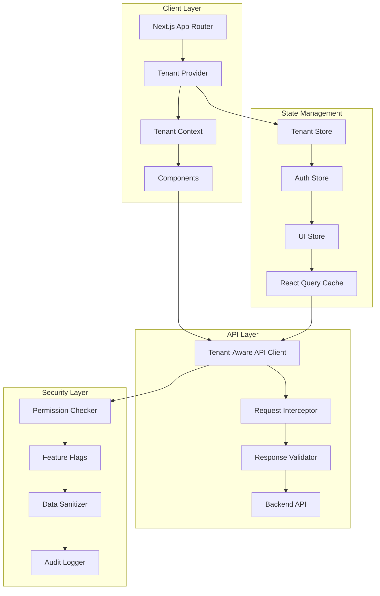
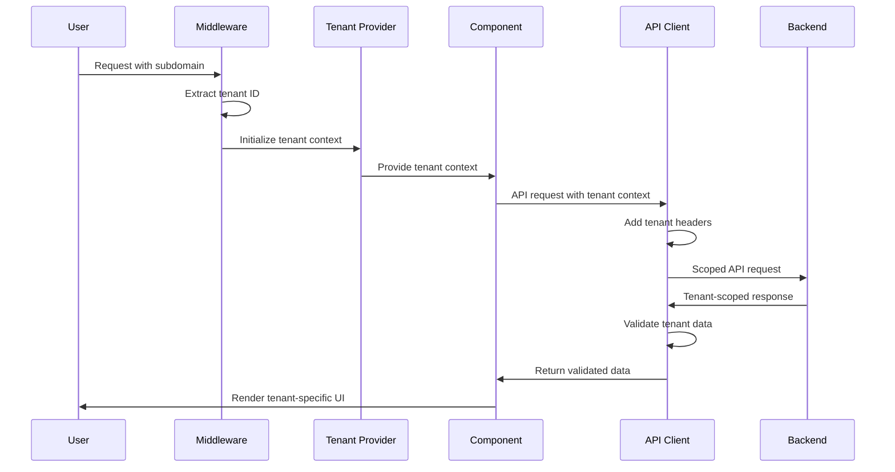

# Design Document

## Overview

This design document outlines the architecture for enhancing the multi-tenant capabilities of the petroleum SaaS application. The current implementation has basic tenant routing but lacks proper isolation, security, and enterprise-grade patterns. This enhancement will implement a comprehensive multi-tenant architecture that ensures data isolation, security, and scalability.

## Architecture

### High-Level Architecture



### Tenant Resolution Strategy

The system will support multiple tenant resolution strategies:

1. **Subdomain-based**: `{tenant}.petromanager.com`
2. **Path-based**: `petromanager.com/{tenant}`
3. **Custom domain**: `{custom-domain}.com`
4. **Header-based**: `X-Tenant-ID` header

### Data Flow Architecture



## Components and Interfaces

### Core Components

#### 1. TenantProvider

```typescript
interface TenantProviderProps {
  children: React.ReactNode;
  fallback?: React.ReactNode;
}

interface TenantContextType {
  tenant: Tenant | null;
  isLoading: boolean;
  error: string | null;
  switchTenant: (tenantId: string) => Promise<void>;
  refreshTenant: () => Promise<void>;
}
```

#### 2. TenantAwareAPIClient

```typescript
interface TenantAwareAPIClient {
  request<T>(endpoint: string, options?: RequestInit): Promise<T>;
  create<T>(resource: string, data: any): Promise<T>;
  findMany<T>(resource: string, filters?: any): Promise<T[]>;
  update<T>(resource: string, id: string, data: any): Promise<T>;
  delete(resource: string, id: string): Promise<void>;
}
```

#### 3. TenantScopedStore

```typescript
interface TenantScopedStore<T> {
  getState: () => T;
  setState: (state: Partial<T>) => void;
  subscribe: (listener: (state: T) => void) => () => void;
  clear: () => void;
}
```

#### 4. PermissionChecker

```typescript
interface PermissionChecker {
  hasPermission: (resource: string, action: string) => boolean;
  hasFeature: (feature: string) => boolean;
  canAccess: (resource: string) => boolean;
  getAvailableFeatures: () => string[];
}
```

### Component Architecture

#### Tenant-Aware Component Pattern

```typescript
interface TenantAwareComponentProps {
  tenant: string;
  children?: React.ReactNode;
}

const TenantAwareComponent: React.FC<TenantAwareComponentProps> = ({
  tenant,
  children
}) => {
  const { hasFeature } = usePermissions();
  const { data, isLoading } = useTenantQuery(['data'], () => fetchData(tenant));

  if (!hasFeature('required-feature')) {
    return <FeatureUnavailable />;
  }

  if (isLoading) return <LoadingSpinner />;

  return <div>{children}</div>;
};
```

#### Protected Component Pattern

```typescript
interface ProtectedComponentProps {
  resource: string;
  action: string;
  fallback?: React.ReactNode;
  children: React.ReactNode;
}

const ProtectedComponent: React.FC<ProtectedComponentProps> = ({
  resource,
  action,
  fallback = null,
  children
}) => {
  const { hasPermission } = usePermissions();

  if (!hasPermission(resource, action)) {
    return fallback;
  }

  return <>{children}</>;
};
```

## Data Models

### Enhanced Tenant Model

```typescript
interface Tenant {
  id: string;
  name: string;
  subdomain: string;
  customDomain?: string;
  plan: 'basic' | 'professional' | 'enterprise';
  status: 'active' | 'suspended' | 'trial';
  settings: TenantSettings;
  branding: BrandingConfig;
  features: FeatureFlags;
  permissions: TenantPermissions;
  limits: TenantLimits;
  createdAt: Date;
  updatedAt: Date;
}

interface TenantSettings {
  timezone: string;
  currency: string;
  dateFormat: string;
  language: string;
  businessHours: BusinessHours;
  notifications: NotificationSettings;
}

interface TenantPermissions {
  resources: Record<string, string[]>;
  features: string[];
  limits: Record<string, number>;
}

interface TenantLimits {
  maxUsers: number;
  maxStorage: number;
  maxApiCalls: number;
  maxCustomFields: number;
}
```

### API Response Models

```typescript
interface TenantScopedResponse<T> {
  data: T;
  tenantId: string;
  metadata: {
    total?: number;
    page?: number;
    limit?: number;
    tenant: string;
  };
}

interface TenantValidationError {
  code: 'TENANT_MISMATCH' | 'TENANT_NOT_FOUND' | 'TENANT_SUSPENDED';
  message: string;
  tenantId: string;
}
```

## Error Handling

### Tenant-Specific Error Handling

```typescript
interface TenantError extends Error {
  tenantId: string;
  code: string;
  context: Record<string, any>;
}

class TenantErrorHandler {
  handle(error: TenantError): void {
    // Log error with tenant context
    this.logError(error);

    // Show appropriate error message
    this.showError(error);

    // Handle security incidents
    if (this.isSecurityIncident(error)) {
      this.handleSecurityIncident(error);
    }
  }

  private isSecurityIncident(error: TenantError): boolean {
    return (
      error.code === 'TENANT_MISMATCH' || error.code === 'CROSS_TENANT_ACCESS'
    );
  }
}
```

### Error Recovery Strategies

1. **Tenant Context Loss**: Automatically re-initialize tenant context
2. **Permission Denied**: Show upgrade prompt or contact support
3. **Data Validation Error**: Sanitize and retry request
4. **Network Error**: Implement exponential backoff with tenant context

## Testing Strategy

### Unit Tests

1. **Tenant Provider Tests**
   - Tenant resolution from different sources
   - Context updates and propagation
   - Error handling and fallbacks

2. **API Client Tests**
   - Request scoping and header injection
   - Response validation and sanitization
   - Error handling and retry logic

3. **Permission Tests**
   - Feature flag evaluation
   - Resource access control
   - Cross-tenant access prevention

### Integration Tests

1. **End-to-End Tenant Flow**
   - Complete tenant onboarding process
   - Feature access based on plan
   - Data isolation verification

2. **Security Tests**
   - Cross-tenant data access attempts
   - Permission bypass attempts
   - Data sanitization validation

### Performance Tests

1. **Multi-Tenant Load Testing**
   - Concurrent tenant access
   - Cache performance with multiple tenants
   - Memory usage with tenant isolation

2. **Scalability Tests**
   - Large number of tenants
   - Tenant-specific data volumes
   - API performance under load

## Security Considerations

### Data Isolation

1. **Request Scoping**: All API requests must include tenant context
2. **Response Validation**: All responses must be validated for tenant ownership
3. **Cache Isolation**: Tenant-specific cache keys and namespaces
4. **Storage Isolation**: Tenant-scoped localStorage and sessionStorage

### Access Control

1. **Feature Flags**: Tenant-level feature access control
2. **Resource Permissions**: Granular resource and action permissions
3. **Rate Limiting**: Per-tenant rate limiting and quotas
4. **Audit Logging**: Comprehensive audit trail for all tenant operations

### Security Monitoring

1. **Cross-Tenant Access Detection**: Real-time monitoring for data leaks
2. **Permission Bypass Attempts**: Detection and alerting
3. **Suspicious Activity**: Anomaly detection per tenant
4. **Security Incident Response**: Automated response to security events

## Performance Optimization

### Caching Strategy

1. **Tenant-Scoped Caching**: Separate cache namespaces per tenant
2. **Intelligent Invalidation**: Tenant-aware cache invalidation
3. **Cache Warming**: Pre-load tenant-specific data
4. **Cache Compression**: Optimize memory usage across tenants

### Data Loading

1. **Lazy Loading**: Load tenant data on demand
2. **Pagination**: Efficient pagination for large datasets
3. **Background Sync**: Sync tenant data in background
4. **Optimistic Updates**: Immediate UI updates with background sync

### Bundle Optimization

1. **Code Splitting**: Tenant-specific code splitting
2. **Dynamic Imports**: Load tenant features dynamically
3. **Tree Shaking**: Remove unused tenant-specific code
4. **Asset Optimization**: Optimize tenant-specific assets
