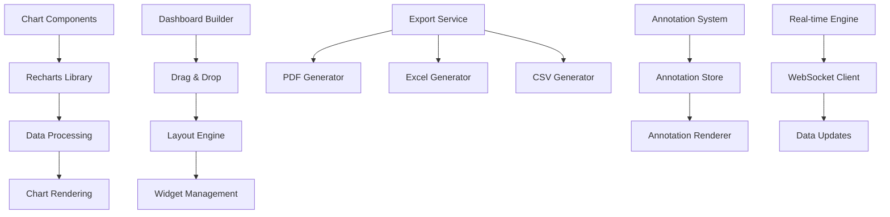
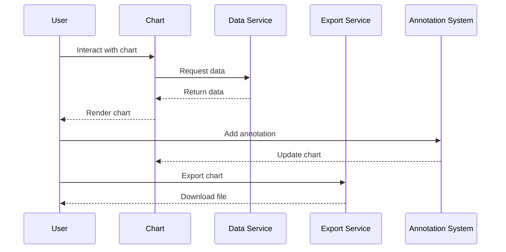

# Advanced Data Visualization Specification

## Overview

This specification defines the advanced data visualization system for the PetroManager frontend application. The system provides interactive charts, custom dashboards, data export capabilities, and real-time visualization for petroleum distribution analytics.

## Requirements

### Requirement 1: Interactive Charts

**User Story:** As a user, I want to interact with charts by zooming, panning, and drilling down, so that I can explore data in detail and gain insights.

#### Acceptance Criteria

1. WHEN a user hovers over chart elements THEN the system SHALL show detailed tooltips
2. WHEN a user clicks on chart elements THEN the system SHALL allow drilling down to detailed views
3. IF a chart supports zooming THEN the system SHALL provide zoom controls and mouse wheel support
4. WHEN a user pans a chart THEN the system SHALL smoothly navigate through data
5. IF a chart has multiple data series THEN the system SHALL allow toggling series visibility

### Requirement 2: Custom Dashboards

**User Story:** As a user, I want to create custom dashboards by dragging and dropping widgets, so that I can organize information according to my workflow.

#### Acceptance Criteria

1. WHEN a user enters dashboard edit mode THEN the system SHALL show draggable widgets
2. WHEN a user drags a widget THEN the system SHALL show drop zones and preview
3. IF a user drops a widget THEN the system SHALL resize and position it appropriately
4. WHEN a user saves a dashboard THEN the system SHALL persist the layout and configuration
5. IF a user shares a dashboard THEN the system SHALL allow other users to view it

### Requirement 3: Data Export

**User Story:** As a user, I want to export charts and data in various formats, so that I can use the information in reports and presentations.

#### Acceptance Criteria

1. WHEN a user requests data export THEN the system SHALL provide PDF, Excel, and CSV options
2. WHEN exporting to PDF THEN the system SHALL maintain chart quality and formatting
3. IF exporting to Excel THEN the system SHALL include both charts and raw data
4. WHEN exporting to CSV THEN the system SHALL include all visible data with proper formatting
5. IF export fails THEN the system SHALL provide error details and retry options

### Requirement 4: Print Support

**User Story:** As a user, I want to print charts and dashboards, so that I can create physical copies for meetings and documentation.

#### Acceptance Criteria

1. WHEN a user prints a chart THEN the system SHALL optimize the layout for paper
2. WHEN printing dashboards THEN the system SHALL arrange widgets for optimal page usage
3. IF printing large datasets THEN the system SHALL paginate appropriately
4. WHEN printing THEN the system SHALL include headers, footers, and metadata
5. IF print preview is available THEN the system SHALL show how the output will look

### Requirement 5: Chart Annotations

**User Story:** As a user, I want to add annotations to charts, so that I can mark important events and add context to the data.

#### Acceptance Criteria

1. WHEN a user adds an annotation THEN the system SHALL allow text, shapes, and arrows
2. WHEN annotating charts THEN the system SHALL position annotations relative to data points
3. IF annotations are added THEN the system SHALL allow editing and deletion
4. WHEN sharing annotated charts THEN the system SHALL include all annotations
5. IF annotations conflict THEN the system SHALL provide collision detection and resolution

### Requirement 6: Real-time Charts

**User Story:** As a user, I want to see charts update in real-time, so that I can monitor live data and trends.

#### Acceptance Criteria

1. WHEN real-time data arrives THEN the system SHALL update charts smoothly
2. WHEN updating charts THEN the system SHALL maintain user's current view and zoom level
3. IF real-time updates are frequent THEN the system SHALL batch updates for performance
4. WHEN real-time mode is enabled THEN the system SHALL indicate live status clearly
5. IF real-time connection is lost THEN the system SHALL fall back to polling mode

## Technical Implementation

### Visualization Architecture

### Chart Flow

### Key Components

- **ChartLibrary**: Recharts-based chart components
- **DashboardBuilder**: Drag-and-drop dashboard creation
- **ExportService**: Multi-format data export
- **AnnotationManager**: Chart annotation system
- **RealTimeEngine**: Live data updates
- **PrintService**: Print optimization and layout
- **DataProcessor**: Data transformation and aggregation

### Chart Types

- **Line Charts**: Time series data, trends, and forecasts
- **Bar Charts**: Comparative data, rankings, and categories
- **Pie Charts**: Proportional data, market share, and distributions
- **Area Charts**: Cumulative data, volume trends, and fill areas
- **Scatter Plots**: Correlation analysis, outliers, and relationships
- **Heat Maps**: Density data, performance matrices, and patterns
- **Gauge Charts**: KPI indicators, tank levels, and progress
- **Combination Charts**: Mixed data types and multi-metric views

### Dashboard Features

- **Widget Library**: Pre-built chart and data widgets
- **Layout System**: Responsive grid-based layouts
- **Theme Support**: Consistent styling and branding
- **Responsive Design**: Mobile and desktop optimization
- **Sharing**: Dashboard sharing and collaboration
- **Templates**: Pre-configured dashboard templates
- **Versioning**: Dashboard change tracking
- **Permissions**: Role-based dashboard access

### Export Capabilities

- **PDF Export**: High-quality chart and dashboard exports
- **Excel Export**: Charts with underlying data
- **CSV Export**: Raw data in spreadsheet format
- **Image Export**: PNG, JPEG, and SVG formats
- **Print Optimization**: Paper-friendly layouts
- **Batch Export**: Multiple charts and dashboards
- **Scheduled Export**: Automated export generation
- **Email Export**: Direct email delivery

### Annotation Features

- **Text Annotations**: Labels, notes, and descriptions
- **Shape Annotations**: Rectangles, circles, and arrows
- **Line Annotations**: Trend lines and reference lines
- **Event Markers**: Important dates and milestones
- **Collaborative Annotations**: Shared annotations between users
- **Annotation Templates**: Reusable annotation styles
- **Export Integration**: Annotations included in exports
- **Version Control**: Annotation change tracking

### Real-time Features

- **WebSocket Integration**: Live data streaming
- **Smooth Animations**: Transitions and updates
- **Performance Optimization**: Efficient data handling
- **Fallback Mechanisms**: Polling when WebSocket fails
- **Data Buffering**: Handle high-frequency updates
- **User Control**: Pause/resume real-time updates
- **Historical Context**: Maintain data history
- **Alert Integration**: Real-time threshold alerts

### Performance Optimization

- **Data Virtualization**: Handle large datasets efficiently
- **Chart Optimization**: Render only visible data
- **Memory Management**: Clean up unused chart instances
- **Lazy Loading**: Load charts on demand
- **Caching**: Cache processed data and rendered charts
- **Bundle Splitting**: Load chart libraries separately
- **Web Workers**: Offload data processing
- **Canvas Rendering**: Use canvas for complex visualizations

### Accessibility Features

- **Screen Reader Support**: ARIA labels and descriptions
- **Keyboard Navigation**: Full keyboard accessibility
- **Color Blind Support**: Alternative color schemes
- **High Contrast**: High contrast mode support
- **Text Alternatives**: Text descriptions for charts
- **Focus Management**: Proper focus indicators
- **Zoom Support**: Scalable chart elements
- **Voice Control**: Voice interaction capabilities

### Testing Strategy

- **Unit Tests**: Test individual chart components
- **Integration Tests**: Test chart interactions and data flow
- **Visual Tests**: Test chart rendering and appearance
- **Performance Tests**: Test with large datasets
- **Export Tests**: Test all export formats
- **Real-time Tests**: Test live data updates
- **Accessibility Tests**: Test screen reader compatibility
- **Cross-browser Tests**: Test chart compatibility
