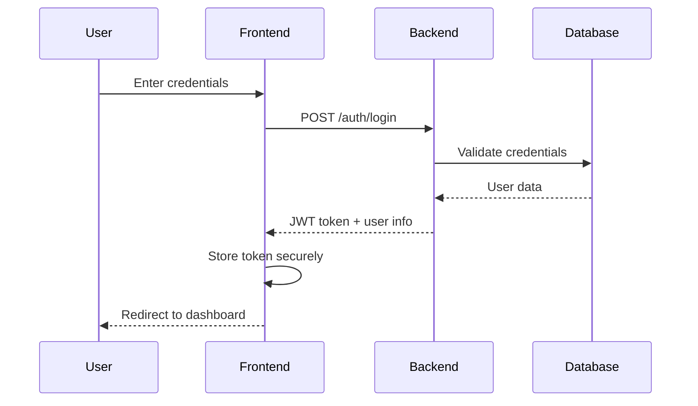

# Authentication & Authorization Specification

## Overview

This specification defines the authentication and authorization system for the PetroManager frontend application. The system provides secure user authentication, role-based access control, and session management for the multi-tenant petroleum distribution platform.

## Requirements

### Requirement 1: User Authentication

**User Story:** As a petroleum distribution company employee, I want to securely log into the system, so that I can access my company's data and perform authorized operations.

#### Acceptance Criteria

1. WHEN a user enters valid credentials THEN the system SHALL authenticate the user and redirect to the dashboard
2. WHEN a user enters invalid credentials THEN the system SHALL display an error message and prevent access
3. IF a user is not authenticated THEN the system SHALL redirect to the login page
4. WHEN a user successfully logs in THEN the system SHALL store authentication tokens securely
5. WHEN a user logs out THEN the system SHALL clear all authentication data and redirect to login

### Requirement 2: Multi-Factor Authentication

**User Story:** As a security-conscious user, I want to enable two-factor authentication, so that my account is protected against unauthorized access.

#### Acceptance Criteria

1. WHEN a user enables 2FA THEN the system SHALL generate and display a QR code for authenticator app setup
2. WHEN a user enters a valid 2FA code THEN the system SHALL complete the authentication process
3. WHEN a user enters an invalid 2FA code THEN the system SHALL display an error and allow retry
4. IF 2FA is enabled THEN the system SHALL require 2FA verification on every login
5. WHEN a user loses access to their 2FA device THEN the system SHALL provide recovery options

### Requirement 3: Password Management

**User Story:** As a user, I want to reset my password when I forget it, so that I can regain access to my account.

#### Acceptance Criteria

1. WHEN a user requests password reset THEN the system SHALL send a reset link to their email
2. WHEN a user clicks the reset link THEN the system SHALL display a password reset form
3. WHEN a user submits a new password THEN the system SHALL validate the password strength
4. IF the password meets requirements THEN the system SHALL update the password and log the user in
5. WHEN a password reset link expires THEN the system SHALL require a new reset request

### Requirement 4: Session Management

**User Story:** As a user, I want my session to be managed securely, so that I don't have to re-authenticate frequently but my account remains secure.

#### Acceptance Criteria

1. WHEN a user is inactive for 30 minutes THEN the system SHALL display a session timeout warning
2. WHEN a user is inactive for 45 minutes THEN the system SHALL automatically log them out
3. WHEN a user's session token expires THEN the system SHALL attempt to refresh the token
4. IF token refresh fails THEN the system SHALL redirect to login
5. WHEN a user logs out THEN the system SHALL invalidate all session tokens

### Requirement 5: Role-Based Access Control

**User Story:** As an administrator, I want to control what different users can access, so that sensitive data is protected and users only see relevant information.

#### Acceptance Criteria

1. WHEN a user accesses a protected route THEN the system SHALL check their role permissions
2. IF a user lacks required permissions THEN the system SHALL display an access denied message
3. WHEN a user's role changes THEN the system SHALL update their available features immediately
4. IF a user attempts unauthorized actions THEN the system SHALL prevent the action and log the attempt
5. WHEN displaying navigation THEN the system SHALL only show menu items the user can access

### Requirement 6: Profile Management

**User Story:** As a user, I want to manage my profile information, so that my account details are accurate and up-to-date.

#### Acceptance Criteria

1. WHEN a user views their profile THEN the system SHALL display their current information
2. WHEN a user updates their profile THEN the system SHALL validate the changes
3. IF validation passes THEN the system SHALL save the changes and show a success message
4. WHEN a user changes their email THEN the system SHALL require email verification
5. WHEN a user updates their password THEN the system SHALL require current password confirmation

## Technical Implementation

### Authentication Flow

### Component Architecture

- **AuthProvider**: Context provider for authentication state
- **LoginForm**: Login form component with validation
- **ProtectedRoute**: Route wrapper for authentication checks
- **RoleGuard**: Component for role-based access control
- **SessionManager**: Service for session handling
- **PasswordReset**: Password reset flow components

### Security Considerations

- JWT tokens stored in httpOnly cookies
- CSRF protection for all state-changing operations
- Rate limiting on authentication endpoints
- Secure password hashing (bcrypt)
- Session timeout and automatic logout
- Audit logging for authentication events

### Error Handling

- Clear error messages for authentication failures
- Graceful handling of network errors
- Retry mechanisms for temporary failures
- Fallback UI for authentication errors
- User-friendly error recovery flows

### Testing Strategy

- Unit tests for authentication components
- Integration tests for authentication flows
- E2E tests for complete user journeys
- Security testing for authentication vulnerabilities
- Performance testing for authentication endpoints
