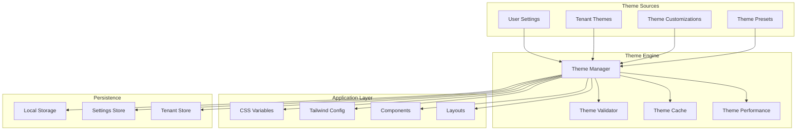

# Comprehensive Theming System Architecture

## Overview

This document outlines a complete theming system for the petroleum SaaS application that integrates multiple theming approaches into a unified, scalable solution. The system combines tenant-aware theming, preset themes, real-time customization, and performance optimization.

## Current State Analysis

### Existing Systems
1. **TenantThemeManager** (`lib/tenant-theme.ts`) - Basic tenant theming with CSS variables
2. **Settings Store** (`stores/settings-store.ts`) - Theme preset management and customization
3. **UI Store** (`stores/ui-store.ts`) - Light/dark mode switching
4. **Tenant-Aware Components** - Components that adapt to tenant branding
5. **Tailwind CSS** - Utility-first styling with CSS variables
6. **Next.js Theme Provider** - Basic theme switching

### Issues Identified
1. **Fragmented Theming** - Multiple disconnected theming systems
2. **No Real-time Application** - Theme changes don't immediately apply to the UI
3. **Limited Customization** - Basic color/font changes only
4. **Performance Issues** - No caching or optimization
5. **Inconsistent Implementation** - Different components use different theming approaches

## Proposed Unified Theming System

### Architecture Overview



### Core Components

#### 1. Unified Theme Manager (`lib/unified-theme-manager.ts`)

```typescript
interface UnifiedTheme {
  // Core theme data
  colors: ColorScheme;
  typography: TypographyConfig;
  spacing: SpacingConfig;
  borderRadius: BorderRadiusConfig;
  shadows: ShadowConfig;
  
  // Branding
  branding: BrandingConfig;
  
  // Advanced theming
  animations: AnimationConfig;
  transitions: TransitionConfig;
  effects: EffectConfig;
  
  // Accessibility
  accessibility: AccessibilityConfig;
  
  // Performance
  optimized: boolean;
  cached: boolean;
}

class UnifiedThemeManager {
  // Theme sources
  private themePresets: Map<string, ThemePreset>;
  private tenantThemes: Map<string, TenantTheme>;
  private customThemes: Map<string, UnifiedTheme>;
  
  // Current state
  private currentTheme: UnifiedTheme;
  private appliedCustomizations: ThemeCustomization[];
  
  // Performance
  private cache: ThemeCacheManager;
  private performanceMonitor: ThemePerformanceMonitor;
  
  // Apply theme with real-time updates
  applyTheme(theme: UnifiedTheme): void;
  
  // Apply preset with customizations
  applyPreset(presetId: string, customizations?: ThemeCustomization): void;
  
  // Real-time customization
  applyCustomization(customization: ThemeCustomization): void;
  
  // Generate CSS variables
  generateCSSVariables(theme: UnifiedTheme): string;
  
  // Update Tailwind config
  updateTailwindConfig(theme: UnifiedTheme): void;
  
  // Validate theme
  validateTheme(theme: UnifiedTheme): ValidationResults;
}
```

#### 2. Theme Application System (`lib/theme-application.ts`)

```typescript
class ThemeApplicationSystem {
  // CSS Variable Injection
  injectCSSVariables(theme: UnifiedTheme): void;
  
  // Dynamic Tailwind Updates
  updateTailwindClasses(theme: UnifiedTheme): void;
  
  // Component Theme Updates
  updateComponentThemes(theme: UnifiedTheme): void;
  
  // Layout Theme Updates
  updateLayoutThemes(theme: UnifiedTheme): void;
  
  // Real-time Preview
  enableRealTimePreview(theme: UnifiedTheme): void;
  
  // Performance Optimization
  optimizeThemeApplication(theme: UnifiedTheme): void;
}
```

#### 3. Enhanced CSS Variable System (`lib/enhanced-css-variables.ts`)

```typescript
interface EnhancedCSSVariables {
  // Core colors
  colors: {
    primary: string;
    secondary: string;
    accent: string;
    background: string;
    surface: string;
    text: string;
    textSecondary: string;
    border: string;
    error: string;
    warning: string;
    success: string;
    info: string;
  };
  
  // Typography
  typography: {
    fontFamily: string;
    headingFont: string;
    fontSize: Record<string, string>;
    fontWeight: Record<string, string>;
    lineHeight: Record<string, string>;
  };
  
  // Spacing
  spacing: Record<string, string>;
  
  // Border radius
  borderRadius: Record<string, string>;
  
  // Shadows
  shadows: Record<string, string>;
  
  // Animations
  animations: Record<string, string>;
  
  // Transitions
  transitions: Record<string, string>;
  
  // Effects
  effects: Record<string, string>;
}

class EnhancedCSSVariableManager {
  generateVariables(theme: UnifiedTheme): EnhancedCSSVariables;
  injectVariables(variables: EnhancedCSSVariables): void;
  updateVariables(variables: Partial<EnhancedCSSVariables>): void;
  optimizeVariables(variables: EnhancedCSSVariables): EnhancedCSSVariables;
}
```

#### 4. Dynamic Tailwind Integration (`lib/dynamic-tailwind.ts`)

```typescript
class DynamicTailwindManager {
  // Update Tailwind config dynamically
  updateConfig(theme: UnifiedTheme): void;
  
  // Generate custom classes
  generateCustomClasses(theme: UnifiedTheme): string;
  
  // Optimize class generation
  optimizeClasses(classes: string[]): string[];
  
  // Cache generated classes
  cacheClasses(theme: UnifiedTheme, classes: string[]): void;
}
```

### Integration Points

#### 1. Root Layout Integration (`app/layout.tsx`)

```typescript
export default function RootLayout({ children }: { children: React.ReactNode }) {
  return (
    <html lang="en">
      <head>
        <ThemeVariableInjector />
        <DynamicTailwindInjector />
      </head>
      <body className={poppins.variable}>
        <Suspense fallback={null}>
          <RouteProgressBar />
        </Suspense>
        <TenantProvider>
          <UnifiedThemeProvider>
            <ThemeApplicationProvider>
              {children}
            </ThemeApplicationProvider>
          </UnifiedThemeProvider>
        </TenantProvider>
      </body>
    </html>
  );
}
```

#### 2. Component Integration

```typescript
// Enhanced tenant-aware components
export function TenantAwareCard({ children, ...props }: TenantAwareCardProps) {
  const { theme, applyTheme } = useUnifiedTheme();
  const { getTenantStyles } = useTenantAwareDesignSystem();
  
  // Apply theme styles
  const themeStyles = useMemo(() => {
    return {
      ...getTenantStyles(),
      ...theme.colors,
      ...theme.typography,
    };
  }, [theme, getTenantStyles]);
  
  return (
    <div style={themeStyles} className="tenant-themed">
      {children}
    </div>
  );
}
```

#### 3. Settings Integration

```typescript
// Enhanced branding settings
export function BrandingSettings({ data, onUpdate }: BrandingSettingsProps) {
  const { applyPreset, applyCustomization, currentTheme } = useUnifiedTheme();
  
  const handlePresetApply = (preset: ThemePreset) => {
    applyPreset(preset.id);
    onUpdate({
      ...data,
      themeManagement: {
        ...data.themeManagement,
        currentPresetId: preset.id,
        lastApplied: new Date(),
      },
    });
  };
  
  const handleCustomizationChange = (customization: ThemeCustomization) => {
    applyCustomization(customization);
    // Real-time preview - no need to save immediately
  };
  
  return (
    <div className="space-y-6">
      <ThemePresetSelector onPresetApply={handlePresetApply} />
      <ThemeCustomizer onCustomizationChange={handleCustomizationChange} />
      <ThemePreview theme={currentTheme} />
    </div>
  );
}
```

### Performance Optimizations

#### 1. Theme Caching (`lib/theme-cache.ts`)

```typescript
class ThemeCacheManager {
  // Cache theme calculations
  cacheThemeCalculations(theme: UnifiedTheme): void;
  
  // Cache CSS variables
  cacheCSSVariables(variables: EnhancedCSSVariables): void;
  
  // Cache Tailwind classes
  cacheTailwindClasses(classes: string[]): void;
  
  // Optimize cache usage
  optimizeCache(): void;
}
```

#### 2. Performance Monitoring (`lib/theme-performance.tsx`)

```typescript
class ThemePerformanceMonitor {
  // Monitor theme application performance
  monitorThemeApplication(theme: UnifiedTheme): PerformanceMetrics;
  
  // Monitor CSS variable injection
  monitorCSSInjection(variables: EnhancedCSSVariables): PerformanceMetrics;
  
  // Monitor component updates
  monitorComponentUpdates(components: string[]): PerformanceMetrics;
  
  // Generate performance report
  generatePerformanceReport(): PerformanceReport;
}
```

### Real-time Theme Application

#### 1. Theme Application Provider (`components/theme-application-provider.tsx`)

```typescript
export function ThemeApplicationProvider({ children }: { children: React.ReactNode }) {
  const { currentTheme } = useUnifiedTheme();
  const { tenant } = useTenant();
  
  useEffect(() => {
    if (currentTheme) {
      // Apply theme immediately
      applyThemeToDocument(currentTheme);
      applyThemeToComponents(currentTheme);
      applyThemeToLayout(currentTheme);
    }
  }, [currentTheme]);
  
  useEffect(() => {
    if (tenant) {
      // Apply tenant-specific theming
      applyTenantTheme(tenant);
    }
  }, [tenant]);
  
  return <>{children}</>;
}
```

#### 2. Document Theme Application (`lib/document-theme-application.ts`)

```typescript
class DocumentThemeApplication {
  // Apply theme to document root
  applyToDocument(theme: UnifiedTheme): void;
  
  // Update CSS variables
  updateCSSVariables(variables: EnhancedCSSVariables): void;
  
  // Update document classes
  updateDocumentClasses(classes: string[]): void;
  
  // Update favicon and title
  updateBranding(branding: BrandingConfig): void;
}
```

### Migration Strategy

#### Phase 1: Foundation (Week 1-2)
1. Create `UnifiedThemeManager`
2. Implement `EnhancedCSSVariableManager`
3. Create `ThemeApplicationProvider`
4. Update root layout

#### Phase 2: Integration (Week 3-4)
1. Integrate with existing `TenantThemeManager`
2. Update `SettingsStore` for theme management
3. Enhance tenant-aware components
4. Implement real-time theme application

#### Phase 3: Optimization (Week 5-6)
1. Implement theme caching
2. Add performance monitoring
3. Optimize CSS variable injection
4. Implement dynamic Tailwind updates

#### Phase 4: Enhancement (Week 7-8)
1. Add advanced theming features
2. Implement theme validation
3. Add accessibility features
4. Create theme export/import

### Testing Strategy

#### 1. Unit Tests
- Theme manager functionality
- CSS variable generation
- Theme validation
- Performance monitoring

#### 2. Integration Tests
- Theme application to components
- Real-time theme updates
- Tenant theme integration
- Settings store integration

#### 3. Performance Tests
- Theme application performance
- CSS variable injection performance
- Component update performance
- Cache effectiveness

#### 4. Accessibility Tests
- Theme accessibility compliance
- Color contrast validation
- Screen reader compatibility
- Keyboard navigation

### Benefits

1. **Unified Theming** - Single source of truth for all theming
2. **Real-time Updates** - Immediate theme application
3. **Performance Optimized** - Caching and monitoring
4. **Accessibility Compliant** - Built-in accessibility features
5. **Scalable** - Easy to extend and maintain
6. **Developer Friendly** - Clear APIs and documentation

### Implementation Timeline

- **Week 1-2**: Core theme manager and CSS variable system
- **Week 3-4**: Integration with existing systems
- **Week 5-6**: Performance optimization and caching
- **Week 7-8**: Advanced features and testing

This comprehensive theming system will provide a robust, scalable, and performant solution for all theming needs in the petroleum SaaS application.
