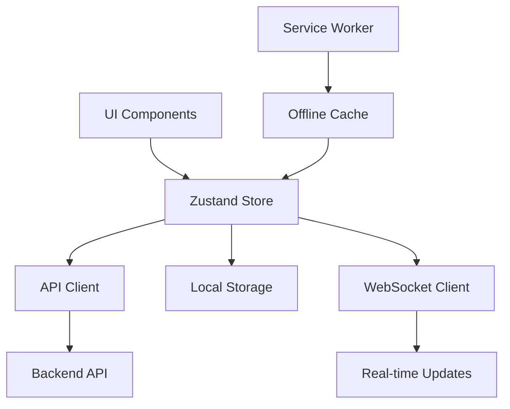
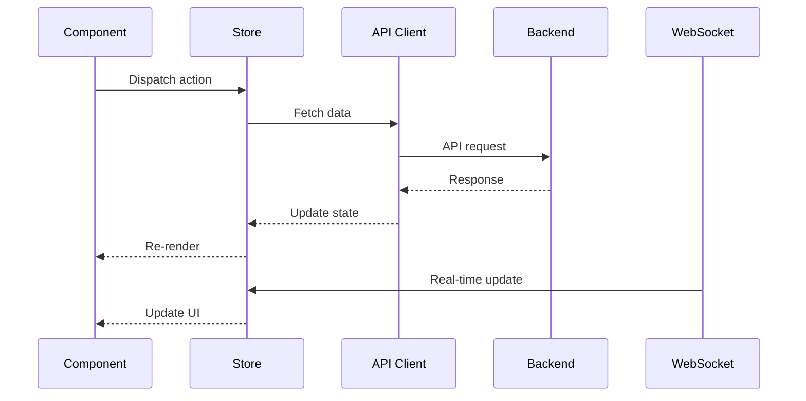

# Data Management & State Specification

## Overview

This specification defines the data management and state management system for the PetroManager frontend application. The system provides efficient data fetching, caching, real-time updates, and offline support for the petroleum distribution platform.

## Requirements

### Requirement 1: API Integration

**User Story:** As a developer, I want a robust API client that handles all backend communication, so that the frontend can reliably fetch and update data.

#### Acceptance Criteria

1. WHEN the frontend makes an API request THEN the system SHALL handle the request with proper error handling
2. IF an API request fails THEN the system SHALL display appropriate error messages to the user
3. WHEN the API returns data THEN the system SHALL validate the data structure before use
4. IF the API is unavailable THEN the system SHALL provide fallback behavior or cached data
5. WHEN making multiple API calls THEN the system SHALL handle them efficiently with proper loading states

### Requirement 2: Data Fetching & Caching

**User Story:** As a user, I want fast data loading with intelligent caching, so that I can work efficiently without waiting for repeated data loads.

#### Acceptance Criteria

1. WHEN data is fetched from the API THEN the system SHALL cache it for future use
2. WHEN cached data is available THEN the system SHALL display it immediately while fetching fresh data
3. IF cached data is stale THEN the system SHALL fetch fresh data in the background
4. WHEN data is updated THEN the system SHALL invalidate related cache entries
5. IF the cache is full THEN the system SHALL use LRU eviction to make space

### Requirement 3: Real-time Updates

**User Story:** As a user, I want to see real-time updates of tank levels and delivery status, so that I can make informed decisions based on current data.

#### Acceptance Criteria

1. WHEN a WebSocket connection is established THEN the system SHALL receive real-time updates
2. WHEN real-time data arrives THEN the system SHALL update the UI immediately
3. IF the WebSocket connection is lost THEN the system SHALL attempt to reconnect automatically
4. WHEN reconnecting THEN the system SHALL resume receiving updates without data loss
5. IF real-time updates fail THEN the system SHALL fall back to polling for updates

### Requirement 4: Offline Support

**User Story:** As a user, I want to continue working when I lose internet connection, so that I can complete critical tasks even in poor network conditions.

#### Acceptance Criteria

1. WHEN the user goes offline THEN the system SHALL continue to work with cached data
2. WHEN the user performs actions offline THEN the system SHALL queue them for later sync
3. WHEN the user comes back online THEN the system SHALL sync queued actions automatically
4. IF there are conflicts during sync THEN the system SHALL resolve them intelligently
5. WHEN offline THEN the system SHALL clearly indicate the offline status to the user

### Requirement 5: Data Synchronization

**User Story:** As a user, I want my data to stay synchronized across devices and sessions, so that I always have access to the most current information.

#### Acceptance Criteria

1. WHEN data changes on one device THEN the system SHALL sync changes to other devices
2. WHEN multiple users edit the same data THEN the system SHALL handle conflicts gracefully
3. IF sync conflicts occur THEN the system SHALL present resolution options to the user
4. WHEN syncing large datasets THEN the system SHALL use incremental sync to minimize bandwidth
5. IF sync fails THEN the system SHALL retry with exponential backoff

### Requirement 6: State Management

**User Story:** As a developer, I want a predictable state management system, so that the application state is consistent and easy to debug.

#### Acceptance Criteria

1. WHEN application state changes THEN the system SHALL update all dependent components
2. WHEN state is updated THEN the system SHALL maintain immutability for predictable updates
3. IF state becomes inconsistent THEN the system SHALL provide debugging tools
4. WHEN the application loads THEN the system SHALL initialize state from persisted data
5. IF state is corrupted THEN the system SHALL recover gracefully with default values

## Technical Implementation

### State Management Architecture

### Data Flow

### Key Components

- **API Client**: Centralized HTTP client with interceptors
- **Zustand Store**: Global state management with persistence
- **React Query**: Server state management and caching
- **WebSocket Manager**: Real-time data updates
- **Offline Manager**: Service worker for offline functionality
- **Sync Manager**: Data synchronization and conflict resolution

### Caching Strategy

- **Memory Cache**: Fast access for frequently used data
- **Local Storage**: Persistent storage for user preferences
- **IndexedDB**: Large dataset storage for offline use
- **Service Worker Cache**: Network response caching
- **CDN Cache**: Static asset caching

### Error Handling

- **Network Errors**: Retry with exponential backoff
- **Validation Errors**: Client-side data validation
- **Sync Conflicts**: User-guided conflict resolution
- **Offline Errors**: Graceful degradation with cached data
- **API Errors**: Structured error handling with user feedback

### Performance Optimization

- **Lazy Loading**: Load data only when needed
- **Pagination**: Handle large datasets efficiently
- **Debouncing**: Reduce API calls for search and filters
- **Memoization**: Cache expensive computations
- **Virtual Scrolling**: Handle large lists efficiently

### Testing Strategy

- **Unit Tests**: Test individual state management functions
- **Integration Tests**: Test API integration and data flow
- **E2E Tests**: Test complete user workflows
- **Performance Tests**: Test with large datasets
- **Offline Tests**: Test offline functionality and sync
