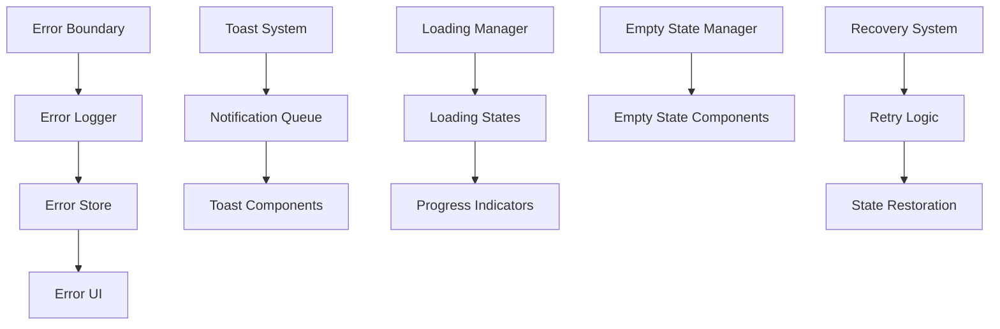
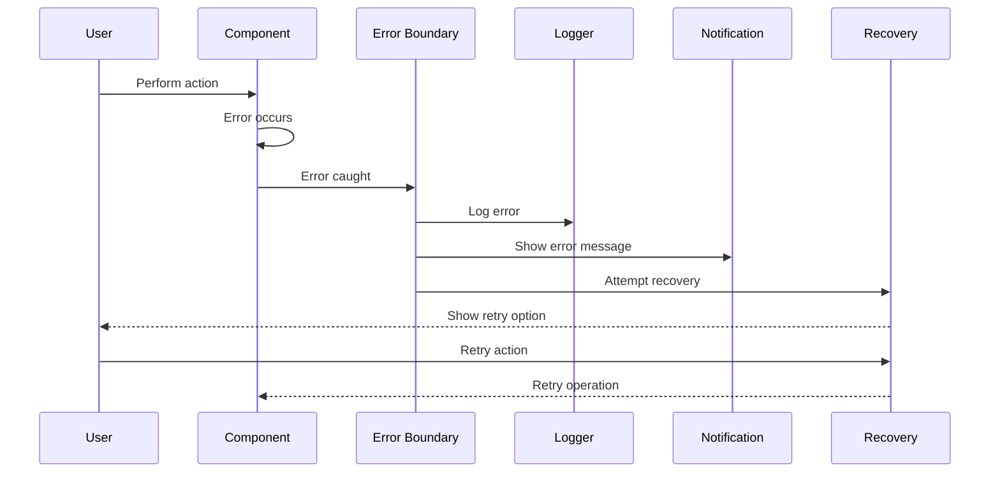

# Error Handling & User Feedback Specification

## Overview

This specification defines the error handling and user feedback system for the PetroManager frontend application. The system provides comprehensive error management, user notifications, loading states, and recovery mechanisms to ensure a smooth user experience.

## Requirements

### Requirement 1: Error Boundaries

**User Story:** As a user, I want the application to handle errors gracefully, so that I can continue working even when something goes wrong.

#### Acceptance Criteria

1. WHEN a JavaScript error occurs THEN the system SHALL catch it with error boundaries
2. WHEN an error is caught THEN the system SHALL display a user-friendly error message
3. IF an error occurs in a component THEN the system SHALL prevent the entire app from crashing
4. WHEN an error boundary is triggered THEN the system SHALL log the error for debugging
5. IF an error is recoverable THEN the system SHALL provide a retry option

### Requirement 2: Toast Notifications

**User Story:** As a user, I want to receive immediate feedback on my actions, so that I know whether my operations succeeded or failed.

#### Acceptance Criteria

1. WHEN a user performs an action THEN the system SHALL show a toast notification
2. WHEN an operation succeeds THEN the system SHALL display a success toast
3. WHEN an operation fails THEN the system SHALL display an error toast with details
4. IF a toast contains important information THEN the system SHALL allow it to be dismissed manually
5. WHEN multiple toasts are shown THEN the system SHALL stack them appropriately

### Requirement 3: Loading States

**User Story:** As a user, I want to see when the system is working, so that I know to wait for operations to complete.

#### Acceptance Criteria

1. WHEN data is being fetched THEN the system SHALL show loading indicators
2. WHEN a form is being submitted THEN the system SHALL show a loading state
3. IF an operation takes longer than 2 seconds THEN the system SHALL show progress indicators
4. WHEN loading THEN the system SHALL disable relevant buttons to prevent double-submission
5. IF loading fails THEN the system SHALL show an error state with retry options

### Requirement 4: Empty States

**User Story:** As a user, I want to see helpful information when there's no data, so that I understand what to do next.

#### Acceptance Criteria

1. WHEN a list is empty THEN the system SHALL show an empty state with helpful messaging
2. WHEN search returns no results THEN the system SHALL suggest alternative searches
3. IF a user has no permissions THEN the system SHALL explain what they can access
4. WHEN showing empty states THEN the system SHALL provide actionable next steps
5. IF empty states are temporary THEN the system SHALL indicate when data might appear

### Requirement 5: Error Recovery

**User Story:** As a user, I want to recover from errors easily, so that I can continue my work without losing progress.

#### Acceptance Criteria

1. WHEN a network error occurs THEN the system SHALL provide a retry button
2. WHEN a validation error occurs THEN the system SHALL highlight the problematic fields
3. IF an operation fails THEN the system SHALL preserve user input for retry
4. WHEN recovering from errors THEN the system SHALL restore the previous state
5. IF recovery is not possible THEN the system SHALL provide alternative actions

### Requirement 6: User Guidance

**User Story:** As a user, I want helpful guidance when using the system, so that I can learn how to use features effectively.

#### Acceptance Criteria

1. WHEN a user first visits a page THEN the system SHALL show tooltips for key features
2. WHEN a user hovers over complex elements THEN the system SHALL show helpful tooltips
3. IF a user makes a common mistake THEN the system SHALL provide helpful suggestions
4. WHEN showing guidance THEN the system SHALL allow users to dismiss it permanently
5. IF guidance is context-sensitive THEN the system SHALL show it at the right time

## Technical Implementation

### Error Handling Architecture

### Error Flow

### Key Components

- **ErrorBoundary**: React error boundary wrapper
- **ErrorLogger**: Centralized error logging service
- **ToastManager**: Notification system management
- **LoadingManager**: Loading state coordination
- **EmptyStateManager**: Empty state handling
- **RecoveryManager**: Error recovery and retry logic
- **GuidanceSystem**: User guidance and tooltips

### Error Types

- **Network Errors**: API failures, timeouts, connectivity issues
- **Validation Errors**: Form validation, data format errors
- **Authentication Errors**: Login failures, session expiry
- **Permission Errors**: Access denied, insufficient privileges
- **Business Logic Errors**: Domain-specific error conditions
- **System Errors**: Unexpected errors, bugs, crashes

### Notification Types

- **Success**: Green toast for successful operations
- **Error**: Red toast for failed operations
- **Warning**: Yellow toast for warnings
- **Info**: Blue toast for informational messages
- **Loading**: Spinner for ongoing operations
- **Progress**: Progress bar for long operations

### Loading States

- **Skeleton Loaders**: Placeholder content while loading
- **Spinners**: Circular loading indicators
- **Progress Bars**: Linear progress for known durations
- **Pulse Effects**: Subtle animation for quick loads
- **Shimmer Effects**: Content-aware loading animations
- **Button Loading**: Disabled buttons with loading state

### Empty States

- **No Data**: Empty lists and tables
- **No Results**: Search with no matches
- **No Permissions**: Access denied states
- **Offline**: Network unavailable states
- **Error States**: Failed to load states
- **Onboarding**: First-time user guidance

### Recovery Mechanisms

- **Automatic Retry**: Retry failed operations automatically
- **Manual Retry**: User-initiated retry buttons
- **State Restoration**: Restore previous application state
- **Data Recovery**: Recover lost form data
- **Session Recovery**: Restore user session after errors
- **Cache Recovery**: Use cached data when available

### User Guidance Features

- **Tooltips**: Contextual help for UI elements
- **Onboarding**: Step-by-step feature introduction
- **Help Text**: Inline help for complex forms
- **Video Tutorials**: Embedded help videos
- **Documentation**: Links to relevant documentation
- **FAQ**: Frequently asked questions

### Performance Considerations

- **Error Debouncing**: Prevent error spam
- **Lazy Error Loading**: Load error details on demand
- **Error Caching**: Cache common error messages
- **Optimistic Updates**: Update UI before server confirmation
- **Error Compression**: Minimize error payload size
- **Background Logging**: Log errors without blocking UI

### Testing Strategy

- **Error Simulation**: Test error scenarios
- **Recovery Testing**: Test error recovery flows
- **Notification Testing**: Test all notification types
- **Loading Testing**: Test all loading states
- **Empty State Testing**: Test all empty state scenarios
- **Guidance Testing**: Test user guidance features
- **Performance Testing**: Test error handling performance
