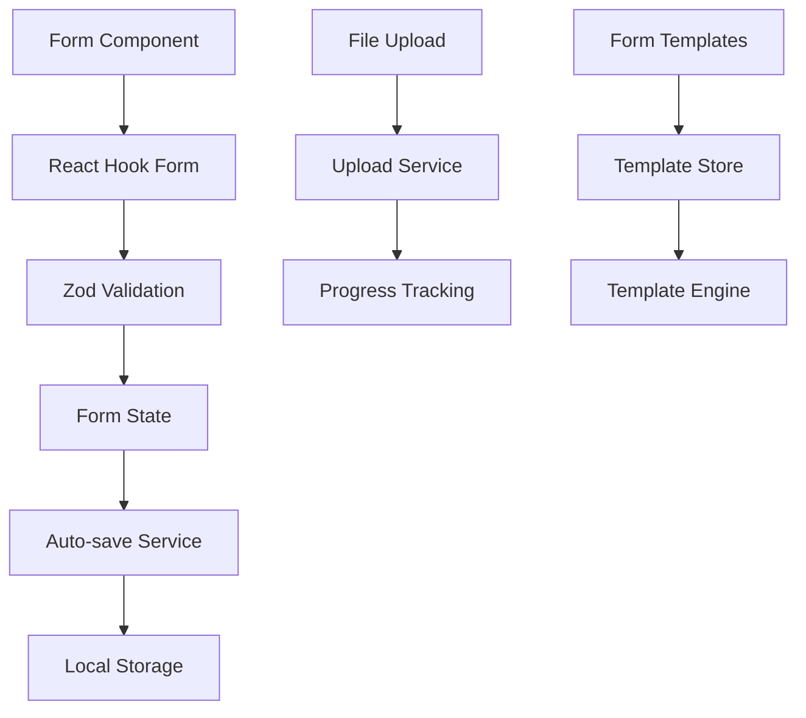
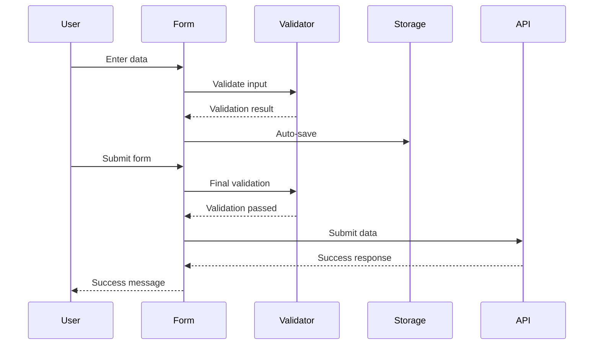

# Form Management & Validation Specification

## Overview

This specification defines the form management and validation system for the PetroManager frontend application. The system provides comprehensive form handling, validation, file uploads, and user experience enhancements for data entry across the petroleum distribution platform.

## Requirements

### Requirement 1: Advanced Form Handling

**User Story:** As a user, I want to fill out complex forms with multiple steps and dependencies, so that I can efficiently enter data for inventory, deliveries, and other operations.

#### Acceptance Criteria

1. WHEN a user starts filling a form THEN the system SHALL save their progress automatically
2. WHEN a user navigates between form steps THEN the system SHALL preserve all entered data
3. IF a user leaves a form incomplete THEN the system SHALL offer to resume later
4. WHEN form fields have dependencies THEN the system SHALL show/hide fields dynamically
5. IF a form has multiple steps THEN the system SHALL show progress indicators

### Requirement 2: Form Validation

**User Story:** As a user, I want immediate feedback on form errors, so that I can correct mistakes before submitting.

#### Acceptance Criteria

1. WHEN a user enters invalid data THEN the system SHALL display validation errors immediately
2. WHEN a user corrects an error THEN the system SHALL clear the error message
3. IF required fields are empty THEN the system SHALL prevent form submission
4. WHEN validating data THEN the system SHALL check both client-side and server-side rules
5. IF validation fails THEN the system SHALL highlight problematic fields clearly

### Requirement 3: File Upload

**User Story:** As a user, I want to upload documents and images, so that I can attach supporting materials to records.

#### Acceptance Criteria

1. WHEN a user selects files THEN the system SHALL validate file type and size
2. WHEN uploading files THEN the system SHALL show progress indicators
3. IF file upload fails THEN the system SHALL allow retry without losing form data
4. WHEN files are uploaded THEN the system SHALL provide preview functionality
5. IF files are too large THEN the system SHALL compress them automatically

### Requirement 4: Form Persistence

**User Story:** As a user, I want my form data to be saved automatically, so that I don't lose work if something goes wrong.

#### Acceptance Criteria

1. WHEN a user types in a form THEN the system SHALL save data every 30 seconds
2. WHEN a user navigates away THEN the system SHALL save form state automatically
3. IF the browser crashes THEN the system SHALL restore form data on return
4. WHEN form data is restored THEN the system SHALL indicate what was recovered
5. IF form data is corrupted THEN the system SHALL provide a clean slate option

### Requirement 5: Bulk Operations

**User Story:** As a user, I want to perform actions on multiple items at once, so that I can efficiently manage large datasets.

#### Acceptance Criteria

1. WHEN a user selects multiple items THEN the system SHALL enable bulk action buttons
2. WHEN performing bulk actions THEN the system SHALL show progress for each item
3. IF some bulk actions fail THEN the system SHALL report which items succeeded/failed
4. WHEN bulk operations complete THEN the system SHALL update the UI accordingly
5. IF bulk operations are large THEN the system SHALL process them in batches

### Requirement 6: Form Templates

**User Story:** As a user, I want to save and reuse form configurations, so that I can quickly fill out similar forms.

#### Acceptance Criteria

1. WHEN a user saves a form template THEN the system SHALL store the field values and structure
2. WHEN a user applies a template THEN the system SHALL populate the form with saved data
3. IF template data is outdated THEN the system SHALL allow updates before applying
4. WHEN creating templates THEN the system SHALL allow naming and categorization
5. IF templates conflict THEN the system SHALL merge them intelligently

## Technical Implementation

### Form Architecture

### Form Flow

### Key Components

- **FormBuilder**: Dynamic form generation from schemas
- **ValidationEngine**: Centralized validation logic
- **FileUploader**: Drag-and-drop file upload with progress
- **FormPersistence**: Auto-save and recovery functionality
- **BulkActionHandler**: Multi-item operation management
- **TemplateManager**: Form template storage and application

### Validation Rules

- **Required Fields**: Mandatory field validation
- **Data Types**: String, number, date, email validation
- **Business Rules**: Custom validation for petroleum industry data
- **Cross-field Validation**: Dependencies between form fields
- **Server Validation**: Backend validation integration
- **Real-time Validation**: Immediate feedback as user types

### File Upload Features

- **Drag & Drop**: Intuitive file selection
- **Progress Tracking**: Real-time upload progress
- **File Validation**: Type, size, and content validation
- **Compression**: Automatic image compression
- **Preview**: File preview before upload
- **Retry Logic**: Automatic retry on failure

### Form Templates

- **Template Creation**: Save current form as template
- **Template Application**: Apply saved templates to new forms
- **Template Management**: Edit, delete, and organize templates
- **Template Sharing**: Share templates between users
- **Version Control**: Track template changes over time
- **Template Validation**: Ensure template compatibility

### Error Handling

- **Validation Errors**: Clear, actionable error messages
- **Network Errors**: Retry mechanisms for failed submissions
- **File Upload Errors**: Specific error handling for uploads
- **Template Errors**: Graceful handling of template issues
- **Recovery Options**: Multiple ways to recover from errors
- **User Guidance**: Helpful suggestions for resolving issues

### Performance Optimization

- **Lazy Validation**: Validate only visible fields
- **Debounced Auto-save**: Reduce storage operations
- **Optimistic Updates**: Update UI before server confirmation
- **Form Virtualization**: Handle large forms efficiently
- **Memory Management**: Clean up unused form data
- **Bundle Splitting**: Load form components on demand

### Testing Strategy

- **Unit Tests**: Test individual form components
- **Integration Tests**: Test form workflows end-to-end
- **Validation Tests**: Test all validation scenarios
- **File Upload Tests**: Test upload functionality
- **Template Tests**: Test template creation and application
- **Performance Tests**: Test with large forms and files
