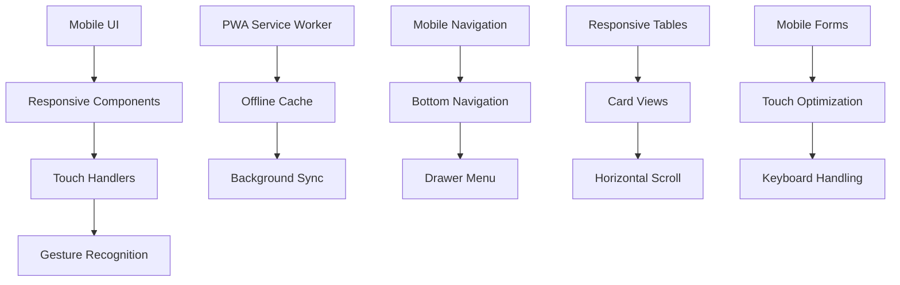
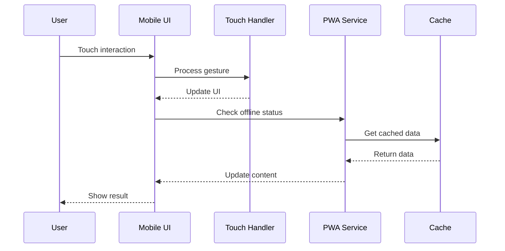

# Mobile Experience Specification

## Overview

This specification defines the mobile experience system for the PetroManager frontend application. The system provides Progressive Web App capabilities, touch-optimized interactions, mobile navigation, and responsive design for optimal mobile user experience.

## Requirements

### Requirement 1: Progressive Web App

**User Story:** As a mobile user, I want the app to work like a native app, so that I can access it quickly and work offline when needed.

#### Acceptance Criteria

1. WHEN a user visits the app on mobile THEN the system SHALL prompt to install as PWA
2. WHEN installed as PWA THEN the system SHALL work offline with cached data
3. IF the user is offline THEN the system SHALL show cached content and offline indicators
4. WHEN the user comes back online THEN the system SHALL sync data automatically
5. IF PWA features are available THEN the system SHALL provide app-like experience

### Requirement 2: Touch Gestures

**User Story:** As a mobile user, I want to use touch gestures naturally, so that I can navigate and interact efficiently.

#### Acceptance Criteria

1. WHEN a user swipes on lists THEN the system SHALL support swipe actions
2. WHEN a user pinches on charts THEN the system SHALL zoom in/out appropriately
3. IF a user long-presses THEN the system SHALL show context menus
4. WHEN a user drags elements THEN the system SHALL provide visual feedback
5. IF touch gestures conflict THEN the system SHALL prioritize the most common gesture

### Requirement 3: Mobile Navigation

**User Story:** As a mobile user, I want easy navigation that works well on small screens, so that I can access all features quickly.

#### Acceptance Criteria

1. WHEN on mobile THEN the system SHALL show a bottom navigation bar
2. WHEN navigating THEN the system SHALL use smooth transitions
3. IF the navigation is complex THEN the system SHALL use collapsible menus
4. WHEN a user taps navigation THEN the system SHALL provide haptic feedback
5. IF navigation is deep THEN the system SHALL show breadcrumbs

### Requirement 4: Responsive Tables

**User Story:** As a mobile user, I want to view table data effectively, so that I can access all information without horizontal scrolling.

#### Acceptance Criteria

1. WHEN tables are too wide THEN the system SHALL convert them to card views
2. WHEN showing table data THEN the system SHALL prioritize important columns
3. IF horizontal scroll is needed THEN the system SHALL provide clear indicators
4. WHEN a user taps a row THEN the system SHALL show detailed view
5. IF tables are complex THEN the system SHALL provide mobile-optimized layouts

### Requirement 5: Mobile Forms

**User Story:** As a mobile user, I want forms that are easy to fill out on touch devices, so that I can enter data efficiently.

#### Acceptance Criteria

1. WHEN a user focuses on input fields THEN the system SHALL show appropriate keyboards
2. WHEN filling forms THEN the system SHALL provide large touch targets
3. IF forms are long THEN the system SHALL break them into steps
4. WHEN validating forms THEN the system SHALL show errors clearly
5. IF form submission fails THEN the system SHALL preserve user input

### Requirement 6: App-like Experience

**User Story:** As a mobile user, I want the app to feel native and responsive, so that I can work efficiently on mobile devices.

#### Acceptance Criteria

1. WHEN the app loads THEN the system SHALL show a splash screen
2. WHEN navigating THEN the system SHALL use native-like animations
3. IF the app is backgrounded THEN the system SHALL maintain state
4. WHEN the app is foregrounded THEN the system SHALL refresh data
5. IF the app crashes THEN the system SHALL recover gracefully

## Technical Implementation

### Mobile Architecture

### Mobile Flow

### Key Components

- **MobileLayout**: Responsive layout system
- **TouchHandler**: Touch gesture recognition
- **PWAManager**: Progressive Web App functionality
- **MobileNavigation**: Mobile-optimized navigation
- **ResponsiveTable**: Mobile table components
- **MobileForm**: Touch-optimized form components
- **OfflineManager**: Offline functionality and sync
- **HapticFeedback**: Touch feedback system

### PWA Features

- **Service Worker**: Offline functionality and caching
- **Web App Manifest**: App installation and metadata
- **Background Sync**: Sync data when connection is restored
- **Push Notifications**: Real-time notifications
- **App Shell**: Fast loading with cached shell
- **Offline Pages**: Custom offline experience
- **Update Management**: Handle app updates gracefully
- **Installation Prompt**: Encourage PWA installation

### Touch Gestures

- **Swipe**: Left/right swipe for actions
- **Pinch**: Zoom in/out for charts and images
- **Long Press**: Context menus and selection
- **Drag**: Drag and drop functionality
- **Tap**: Standard touch interaction
- **Double Tap**: Zoom or special actions
- **Pull to Refresh**: Refresh content
- **Swipe to Delete**: Delete items with swipe

### Mobile Navigation

- **Bottom Navigation**: Primary navigation at bottom
- **Drawer Menu**: Slide-out navigation menu
- **Tab Navigation**: Tab-based navigation
- **Breadcrumbs**: Hierarchical navigation
- **Back Button**: Native back button support
- **Search Bar**: Prominent search functionality
- **Quick Actions**: Floating action buttons
- **Navigation Guards**: Prevent accidental navigation

### Responsive Table Features

- **Card Views**: Convert tables to cards on mobile
- **Horizontal Scroll**: Scrollable tables with indicators
- **Column Prioritization**: Show most important columns first
- **Expandable Rows**: Tap to expand for details
- **Sortable Headers**: Touch-friendly sorting
- **Filter Integration**: Mobile-optimized filters
- **Pagination**: Touch-friendly pagination
- **Export Options**: Mobile-accessible export

### Mobile Form Features

- **Touch Targets**: Minimum 44px touch targets
- **Keyboard Types**: Appropriate keyboard for input type
- **Input Validation**: Real-time validation feedback
- **Auto-complete**: Smart auto-completion
- **Step-by-step**: Break long forms into steps
- **Progress Indicators**: Show form completion progress
- **Error Handling**: Clear error messages
- **Auto-save**: Save form data automatically

### Performance Optimization

- **Lazy Loading**: Load content on demand
- **Image Optimization**: Optimize images for mobile
- **Code Splitting**: Split code for faster loading
- **Caching Strategy**: Aggressive caching for offline use
- **Bundle Optimization**: Minimize bundle size
- **Memory Management**: Efficient memory usage
- **Battery Optimization**: Minimize battery drain
- **Network Optimization**: Optimize for mobile networks

### Accessibility Features

- **Touch Accessibility**: Large touch targets
- **Screen Reader**: Full screen reader support
- **Voice Control**: Voice input and commands
- **High Contrast**: High contrast mode
- **Font Scaling**: Respect system font size
- **Color Blind Support**: Color blind friendly design
- **Motor Accessibility**: Support for assistive devices
- **Cognitive Accessibility**: Simple, clear interfaces

### Testing Strategy

- **Device Testing**: Test on various mobile devices
- **Touch Testing**: Test all touch interactions
- **PWA Testing**: Test PWA functionality
- **Offline Testing**: Test offline capabilities
- **Performance Testing**: Test mobile performance
- **Accessibility Testing**: Test mobile accessibility
- **Network Testing**: Test on various network conditions
- **Battery Testing**: Test battery impact
