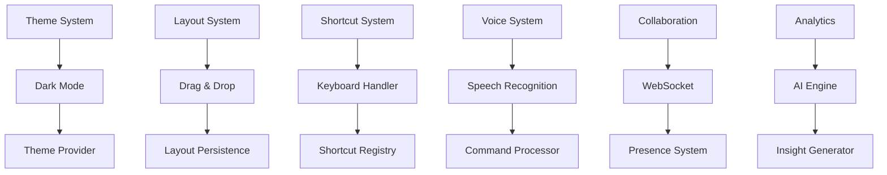
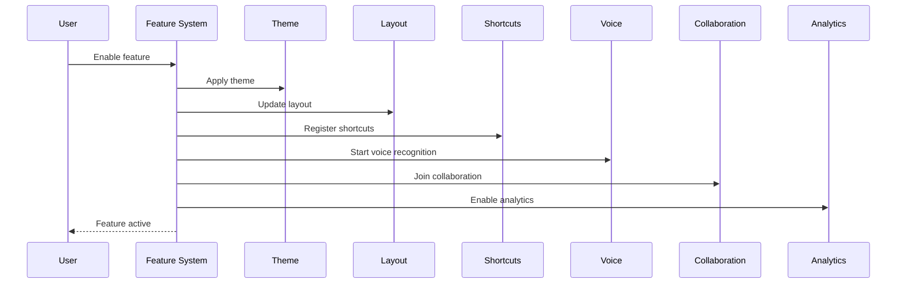

# Nice-to-Have Features Specification

## Overview

This specification defines the nice-to-have features for the PetroManager frontend application. These features enhance the user experience and provide advanced capabilities that differentiate the platform in the market.

## Requirements

### Requirement 1: Dark Mode

**User Story:** As a user, I want to switch between light and dark themes, so that I can work comfortably in different lighting conditions.

#### Acceptance Criteria

1. WHEN a user enables dark mode THEN the system SHALL apply dark theme to all components
2. WHEN switching themes THEN the system SHALL preserve user preference across sessions
3. IF the system supports it THEN the system SHALL detect and follow system theme preference
4. WHEN in dark mode THEN the system SHALL ensure proper contrast ratios for accessibility
5. IF theme switching fails THEN the system SHALL fall back to the previous theme

### Requirement 2: Customizable Layouts

**User Story:** As a user, I want to customize my dashboard layout, so that I can organize information according to my workflow.

#### Acceptance Criteria

1. WHEN a user enters layout edit mode THEN the system SHALL show draggable widgets
2. WHEN a user reorders widgets THEN the system SHALL save the new layout
3. IF a user resizes widgets THEN the system SHALL maintain responsive behavior
4. WHEN saving layouts THEN the system SHALL allow naming and sharing
5. IF layout conflicts occur THEN the system SHALL resolve them gracefully

### Requirement 3: Keyboard Shortcuts

**User Story:** As a power user, I want keyboard shortcuts for common actions, so that I can work more efficiently.

#### Acceptance Criteria

1. WHEN a user presses a shortcut key THEN the system SHALL execute the corresponding action
2. WHEN showing shortcuts THEN the system SHALL display them in tooltips and help
3. IF shortcuts conflict THEN the system SHALL prioritize the most common action
4. WHEN customizing shortcuts THEN the system SHALL allow user-defined key combinations
5. IF shortcuts are disabled THEN the system SHALL provide alternative access methods

### Requirement 4: Voice Commands

**User Story:** As a user, I want to use voice commands for hands-free operation, so that I can work while multitasking.

#### Acceptance Criteria

1. WHEN a user enables voice commands THEN the system SHALL start listening for commands
2. WHEN a voice command is recognized THEN the system SHALL execute the corresponding action
3. IF voice recognition fails THEN the system SHALL provide visual feedback
4. WHEN using voice commands THEN the system SHALL respect privacy and security
5. IF voice commands are not available THEN the system SHALL degrade gracefully

### Requirement 5: Real-time Collaboration

**User Story:** As a user, I want to collaborate with team members in real-time, so that we can work together on shared tasks.

#### Acceptance Criteria

1. WHEN multiple users work on the same data THEN the system SHALL show their presence
2. WHEN a user makes changes THEN the system SHALL update other users immediately
3. IF conflicts occur THEN the system SHALL provide conflict resolution tools
4. WHEN collaborating THEN the system SHALL show who made what changes
5. IF collaboration fails THEN the system SHALL fall back to individual editing

### Requirement 6: Advanced Analytics

**User Story:** As a user, I want AI-powered insights and recommendations, so that I can make better business decisions.

#### Acceptance Criteria

1. WHEN analyzing data THEN the system SHALL provide intelligent insights
2. WHEN showing recommendations THEN the system SHALL explain the reasoning
3. IF insights are inaccurate THEN the system SHALL allow user feedback
4. WHEN generating reports THEN the system SHALL include predictive analytics
5. IF analytics fail THEN the system SHALL provide basic reporting

## Technical Implementation

### Feature Architecture

### Feature Integration

### Key Components

- **ThemeManager**: Dark mode and theme switching
- **LayoutManager**: Customizable dashboard layouts
- **ShortcutManager**: Keyboard shortcut system
- **VoiceManager**: Voice command recognition
- **CollaborationManager**: Real-time collaboration
- **AnalyticsEngine**: AI-powered insights
- **FeatureToggle**: Feature flag management
- **UserPreferences**: User customization storage

### Dark Mode Features

- **Theme Switching**: Toggle between light and dark themes
- **System Integration**: Follow system theme preferences
- **Component Theming**: All components support dark mode
- **Image Adaptation**: Optimize images for dark mode
- **Contrast Compliance**: Maintain accessibility standards
- **Smooth Transitions**: Animated theme switching
- **Persistence**: Remember user preference
- **Fallback**: Graceful degradation if theme fails

### Layout Customization Features

- **Drag & Drop**: Rearrange dashboard widgets
- **Resize**: Resize widgets to fit needs
- **Add/Remove**: Add or remove widgets
- **Templates**: Pre-built layout templates
- **Sharing**: Share layouts with team members
- **Versioning**: Track layout changes
- **Responsive**: Maintain responsiveness
- **Validation**: Ensure layout validity

### Keyboard Shortcut Features

- **Global Shortcuts**: App-wide keyboard shortcuts
- **Context Shortcuts**: Context-specific shortcuts
- **Custom Shortcuts**: User-defined shortcuts
- **Shortcut Help**: Built-in shortcut reference
- **Conflict Resolution**: Handle shortcut conflicts
- **Accessibility**: Screen reader compatible
- **Internationalization**: Support different keyboard layouts
- **Learning**: Suggest shortcuts based on usage

### Voice Command Features

- **Speech Recognition**: Convert speech to text
- **Command Processing**: Execute voice commands
- **Natural Language**: Understand natural language
- **Context Awareness**: Understand context
- **Privacy**: Secure voice processing
- **Offline Support**: Work without internet
- **Custom Commands**: User-defined commands
- **Feedback**: Visual and audio feedback

### Collaboration Features

- **Presence**: Show who's online
- **Real-time Updates**: Live data synchronization
- **Conflict Resolution**: Handle editing conflicts
- **Change Tracking**: Track who made changes
- **Comments**: Inline comments and discussions
- **Notifications**: Real-time notifications
- **Permissions**: Role-based collaboration
- **History**: Track collaboration history

### Analytics Features

- **Predictive Analytics**: Forecast trends
- **Insights**: AI-generated insights
- **Recommendations**: Actionable recommendations
- **Anomaly Detection**: Identify unusual patterns
- **Performance Metrics**: Track system performance
- **User Behavior**: Analyze user behavior
- **Business Intelligence**: Advanced reporting
- **Machine Learning**: Continuous learning

### Performance Considerations

- **Lazy Loading**: Load features on demand
- **Feature Flags**: Enable/disable features dynamically
- **Resource Management**: Efficient resource usage
- **Caching**: Cache feature data
- **Optimization**: Optimize feature performance
- **Monitoring**: Monitor feature usage
- **Fallbacks**: Graceful degradation
- **Testing**: Comprehensive feature testing

### Accessibility Features

- **Screen Reader**: Full screen reader support
- **Keyboard Navigation**: Complete keyboard access
- **High Contrast**: High contrast mode support
- **Voice Control**: Voice input and commands
- **Motor Accessibility**: Support for assistive devices
- **Cognitive Accessibility**: Simple, clear interfaces
- **Internationalization**: Multi-language support
- **Customization**: User customization options

### Testing Strategy

- **Unit Tests**: Test individual features
- **Integration Tests**: Test feature interactions
- **User Testing**: Test with real users
- **Accessibility Tests**: Test accessibility features
- **Performance Tests**: Test feature performance
- **Compatibility Tests**: Test across devices
- **Security Tests**: Test feature security
- **Usability Tests**: Test user experience
