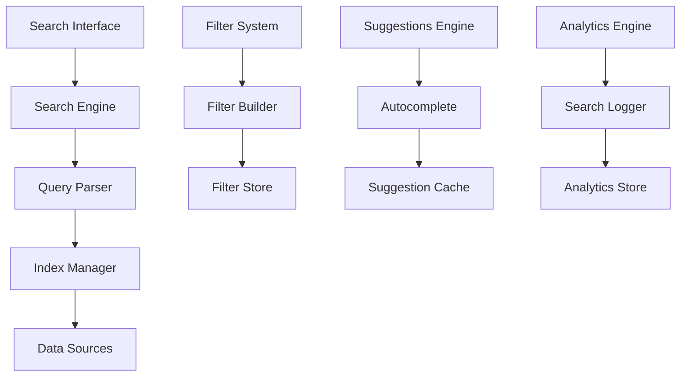
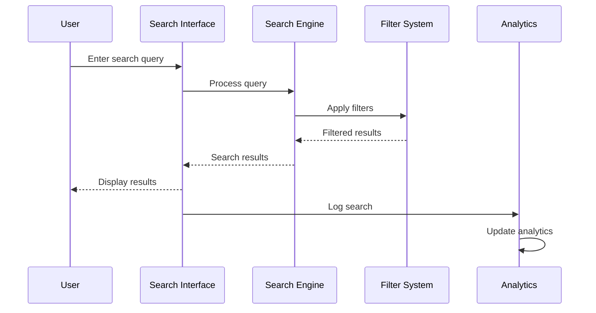

# Search & Filtering Specification

## Overview

This specification defines the search and filtering system for the PetroManager frontend application. The system provides comprehensive search capabilities, advanced filtering, search suggestions, and search analytics for efficient data discovery across the petroleum distribution platform.

## Requirements

### Requirement 1: Global Search

**User Story:** As a user, I want to search across all data in the system, so that I can quickly find any information I need.

#### Acceptance Criteria

1. WHEN a user enters a search query THEN the system SHALL search across all relevant data types
2. WHEN search results are returned THEN the system SHALL rank them by relevance
3. IF search results are found THEN the system SHALL display them with context and highlights
4. WHEN no results are found THEN the system SHALL suggest alternative search terms
5. IF search takes longer than 2 seconds THEN the system SHALL show loading indicators

### Requirement 2: Advanced Filters

**User Story:** As a user, I want to apply multiple filters to narrow down results, so that I can find exactly what I'm looking for.

#### Acceptance Criteria

1. WHEN a user applies filters THEN the system SHALL combine them with AND logic
2. WHEN filters are applied THEN the system SHALL show the active filter count
3. IF a user removes a filter THEN the system SHALL update results immediately
4. WHEN applying multiple filters THEN the system SHALL show how many results match
5. IF filters conflict THEN the system SHALL indicate the conflict and suggest resolution

### Requirement 3: Search Suggestions

**User Story:** As a user, I want to see search suggestions as I type, so that I can find what I'm looking for faster.

#### Acceptance Criteria

1. WHEN a user types in the search box THEN the system SHALL show autocomplete suggestions
2. WHEN suggestions are shown THEN the system SHALL highlight matching text
3. IF a user selects a suggestion THEN the system SHALL execute the search immediately
4. WHEN showing suggestions THEN the system SHALL prioritize popular and recent searches
5. IF suggestions are not relevant THEN the user SHALL be able to dismiss them

### Requirement 4: Search History

**User Story:** As a user, I want to see my recent searches, so that I can quickly repeat previous searches.

#### Acceptance Criteria

1. WHEN a user performs a search THEN the system SHALL save it to their search history
2. WHEN a user views search history THEN the system SHALL show recent searches with timestamps
3. IF a user clicks on a history item THEN the system SHALL execute that search
4. WHEN managing history THEN the system SHALL allow clearing individual items or all history
5. IF search history is full THEN the system SHALL remove oldest entries automatically

### Requirement 5: Filter Persistence

**User Story:** As a user, I want my filters to persist across page navigation, so that I don't lose my search context.

#### Acceptance Criteria

1. WHEN a user applies filters THEN the system SHALL save them to the URL
2. WHEN a user navigates away THEN the system SHALL preserve filter state
3. IF a user returns to a page THEN the system SHALL restore previous filters
4. WHEN sharing URLs THEN the system SHALL include filter parameters
5. IF filters are invalid THEN the system SHALL reset to default state

### Requirement 6: Search Analytics

**User Story:** As an administrator, I want to understand how users search, so that I can improve the search experience.

#### Acceptance Criteria

1. WHEN users perform searches THEN the system SHALL log search terms and results
2. WHEN analyzing search data THEN the system SHALL identify popular and failed searches
3. IF search results are frequently clicked THEN the system SHALL boost their ranking
4. WHEN search fails THEN the system SHALL log the failure for improvement
5. IF search patterns are identified THEN the system SHALL suggest search optimizations

## Technical Implementation

### Search Architecture

### Search Flow

### Key Components

- **SearchEngine**: Core search functionality and query processing
- **FilterManager**: Advanced filtering and combination logic
- **SuggestionEngine**: Autocomplete and search suggestions
- **SearchHistory**: User search history management
- **FilterPersistence**: URL-based filter state management
- **SearchAnalytics**: Search behavior tracking and analysis
- **IndexManager**: Search index maintenance and optimization

### Search Features

- **Full-text Search**: Search across all text content
- **Fuzzy Search**: Handle typos and variations
- **Phrase Search**: Exact phrase matching
- **Wildcard Search**: Pattern matching with \* and ?
- **Boolean Search**: AND, OR, NOT operators
- **Field-specific Search**: Search within specific data fields
- **Date Range Search**: Search within date ranges
- **Numeric Range Search**: Search within numeric ranges

### Filter Types

- **Text Filters**: String matching and pattern filters
- **Date Filters**: Date range and relative date filters
- **Numeric Filters**: Range, comparison, and aggregation filters
- **Category Filters**: Dropdown and multi-select filters
- **Boolean Filters**: Yes/no and true/false filters
- **Location Filters**: Geographic and proximity filters
- **Status Filters**: State and condition filters
- **Custom Filters**: User-defined filter criteria

### Suggestion Features

- **Autocomplete**: Real-time search suggestions
- **Popular Searches**: Most frequently used search terms
- **Recent Searches**: User's recent search history
- **Related Searches**: Similar or related search terms
- **Spell Correction**: Automatic spelling correction
- **Synonym Suggestions**: Alternative terms and synonyms
- **Category Suggestions**: Search within specific categories
- **Trending Searches**: Currently popular search terms

### Search History Features

- **Recent Searches**: Chronological list of recent searches
- **Saved Searches**: Bookmarked searches for quick access
- **Search Favorites**: Marked favorite search terms
- **Search Sharing**: Share searches with other users
- **History Export**: Export search history data
- **History Cleanup**: Automatic and manual history management
- **Privacy Controls**: Control what gets saved in history
- **Cross-device Sync**: Sync search history across devices

### Filter Persistence Features

- **URL Parameters**: Filters stored in URL for sharing
- **Local Storage**: Browser-based filter persistence
- **Session Storage**: Temporary filter state
- **User Preferences**: Saved filter preferences
- **Default Filters**: System-wide default filter settings
- **Filter Templates**: Reusable filter configurations
- **Filter Inheritance**: Inherit filters from parent contexts
- **Filter Validation**: Ensure filter validity across sessions

### Analytics Features

- **Search Metrics**: Track search volume and patterns
- **Result Analytics**: Analyze search result effectiveness
- **User Behavior**: Track user search behavior
- **Performance Metrics**: Monitor search performance
- **Trend Analysis**: Identify search trends over time
- **Failure Analysis**: Analyze failed searches
- **Optimization Insights**: Suggest search improvements
- **Reporting**: Generate search analytics reports

### Performance Optimization

- **Search Indexing**: Optimize search index for fast queries
- **Query Caching**: Cache frequent search queries
- **Result Pagination**: Handle large result sets efficiently
- **Lazy Loading**: Load search results on demand
- **Debounced Search**: Reduce API calls during typing
- **Search Optimization**: Optimize search algorithms
- **Memory Management**: Efficient memory usage for search
- **Background Indexing**: Update search index in background

### Accessibility Features

- **Keyboard Navigation**: Full keyboard search support
- **Screen Reader Support**: ARIA labels for search elements
- **High Contrast**: High contrast mode for search
- **Voice Search**: Voice input for search queries
- **Search Shortcuts**: Keyboard shortcuts for search
- **Focus Management**: Proper focus handling in search
- **Error Announcements**: Screen reader error announcements
- **Search Guidance**: Helpful search instructions

### Testing Strategy

- **Unit Tests**: Test individual search components
- **Integration Tests**: Test search workflows end-to-end
- **Performance Tests**: Test search with large datasets
- **Usability Tests**: Test search user experience
- **Accessibility Tests**: Test search accessibility
- **Analytics Tests**: Test search tracking and analytics
- **Filter Tests**: Test all filter combinations
- **Suggestion Tests**: Test autocomplete and suggestions
